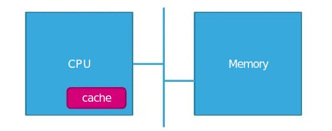
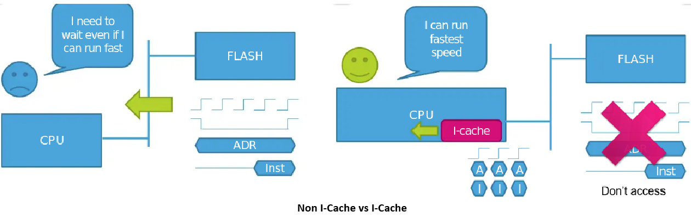
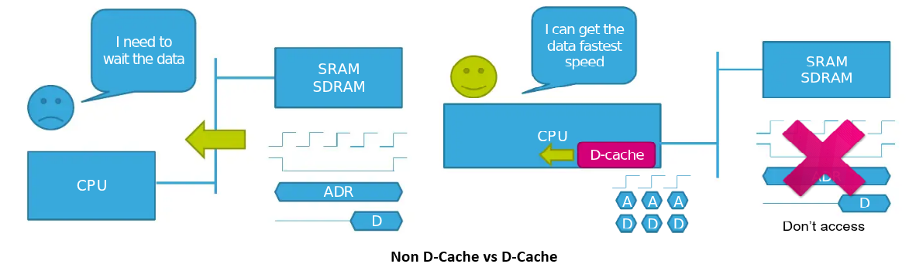
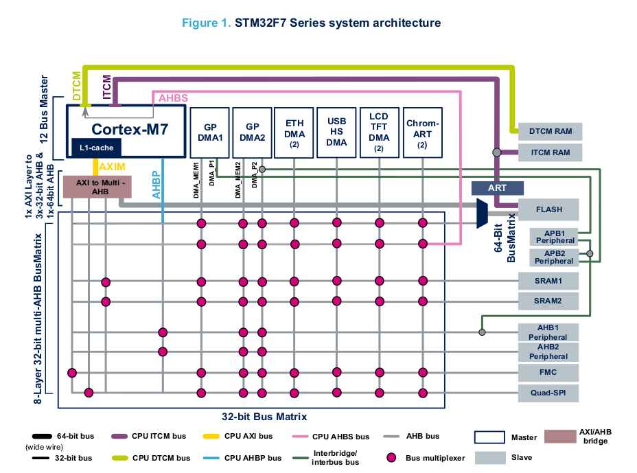
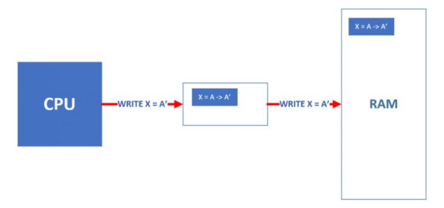
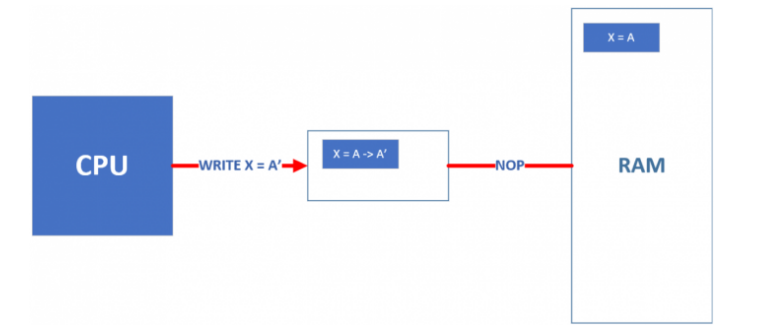
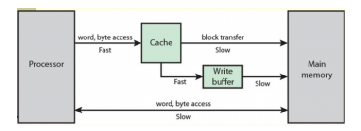
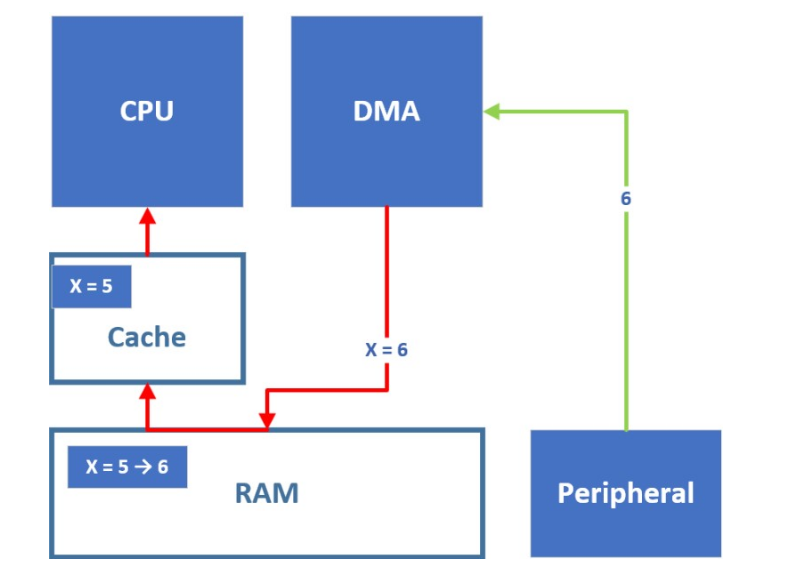
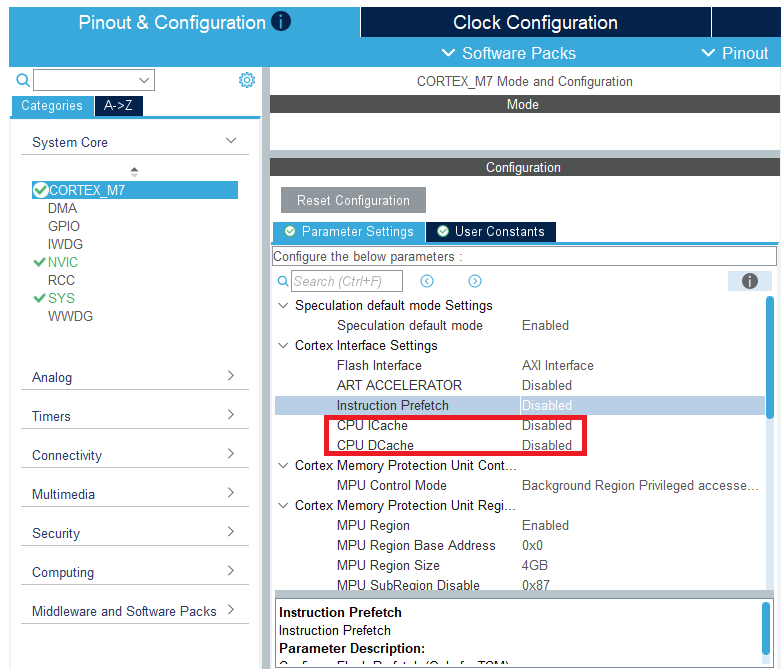
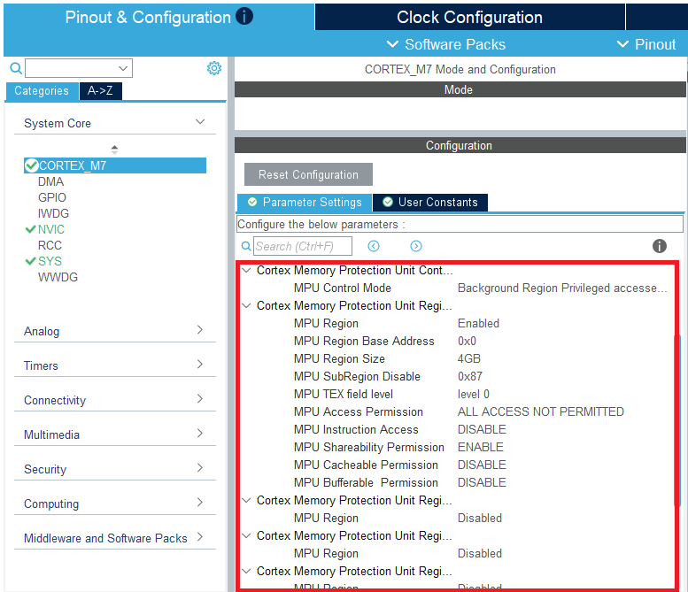

# Level 1 cache on STM32F7 Series and STM32H7 Series
## What is cache ?
- Cache (Bộ nhớ đệm) là một thành phần bộ nhớ đóng vai trò trung gian **nằm giữa CPU và bộ nhớ ngoài** (Memory), thường được chế tạo tích hợp **trực tiếp** vào bên trong **lõi vi xử lý(CPU core)** trên các hệ thống SoC hiện đại như Cortex-M7. 
- Chức năng cốt lõi của Cache là giúp hệ thống tiết kiệm thời gian mỗi khi CPU cần **truy xuất** các **tập lệnh (instruction)** và **dữ liệu (data)** từ bộ nhớ ngoài.

## I-Cache
- I-Cache hay Instruction Cache là bộ nhớ đệm lệnh bên trong CPU. Nó có nhiệm vụ lưu trữ tạm thời các lệnh (chỉ thị) mà CPU chuẩn bị thực thi, giúp hệ thống hoạt động nhanh hơn thay vì phải liên tục chờ đợi tải lệnh từ RAM.
### Vấn đề nút thắt cổ chai của bộ nhớ Flash (Wait States)
- Trong các vi điều khiển hiệu năng cao, lõi CPU hoạt động ở xung nhịp rất lớn, tương đương với việc xử lý một chu kỳ lệnh (clock cycle) chỉ trong khoảng 2.5 đến 5 nano-giây. Tuy nhiên, thời gian truy xuất vật lý của bộ nhớ Flash ngoài lại rất chậm, thường mất từ 50 đến 100 nano-giây để trả về một tập lệnh.
- Sự chênh lệch tốc độ khổng lồ này buộc CPU phải chèn thêm các "trạng thái chờ" (Wait States). Khi đó, CPU bị đình trệ trong nhiều chu kỳ xung nhịp và không thể thực hiện bất kỳ phép toán nào chỉ để đợi lấy lệnh từ Flash. Điều này làm suy giảm nghiêm trọng hiệu suất tổng thể của hệ thống, khiến CPU không thể phát huy được sức mạnh phần cứng vốn có.

## D-Cache
- D-Cache hay Data cache (Bộ nhớ đệm dữ liệu) chỉ được sử dụng cho dữ liệu. Cơ chế của nó tương tự như I-cache (Instruction Cache - bộ nhớ đệm lệnh).Do việc lấy dữ liệu trực tiếp từ bộ nhớ ngoài (external memory) như SRAM hoặc SDRAM mất rất nhiều thời gian. D-Cache (Data Cache) đóng vai trò là "vùng đệm" tốc độ cao giữa lõi xử lý và các bộ nhớ có độ trễ lớn. D-Cache giúp CPU có thể truy xuất dữ liệu chỉ trong 1 chu kỳ máy

## Cách hoạt động của Cache trong Arm Cortex-M7
- Lõi ARM Cortex-M7 là một trong những lõi vi điều khiển đầu tiên của dòng Cortex-M được trang bị kiến trúc bộ nhớ đệm L1 (Level 1 Cache) tích hợp sẵn bên trong lõi.
- Dòng STM32F7 và STM32H7 tích hợp tối đa **16 KB** bộ nhớ đệm L1-cache cho cả instruction cache và data cache.
  

### Cấu trúc và Tổ chức vật lý
- Bộ nhớ đệm trong Cortex-M7 không lưu trữ dữ liệu một cách lộn xộn, mà được tổ chức cực kỳ chặt chẽ dựa trên các thông số phần cứng:
  
    - Ở cấp độ tổng thể, Cache được chia thành **nhiều tập hợp độc lập, gọi là Set**. Bên trong mỗi Set lại tiếp tục được **chia thành nhiều đường, gọi là Cache Line**.
   
    - **Kích thước đường (Cache Line Size)**: Cả I-Cache và D-Cache đều chia nhỏ không gian lưu trữ thành các khối cố định gọi là "Cache Line". Trên Cortex-M7, mỗi Cache Line có kích thước chuẩn là **32 Bytes**. Có nghĩa là mỗi khi ra lệnh đọc từ Flash hay RAM ngoài, Cache sẽ lấy đúng một cụm 32 Bytes mang về. Chứ không lấy từng byte riêng lẻ.
  
    - **Tính liên kết tập hợp (Set-Associativity)**: 
        - D-Cache sử dụng kiến trúc 4-way set associative (liên kết tập hợp 4 đường). Có nghĩa là mỗi Set chứa chính xác 4 Line (tương đương 4 chỗ chứa độc lập để lưu các dữ liệu có chung chỉ số Set).
        - I-Cache thường sử dụng kiến trúc 2-way hoặc 4-way set associative.
        - Việc tổ chức này giúp phần cứng CPU **giảm bớt số lượng phép toán so sánh địa chỉ** khi cần tìm kiếm xem một dữ liệu đã nằm trong Cache hay chưa, từ đó tăng tốc độ truy xuất.
### Nguyên lý hoạt động "Tính địa phương" (Locality Principle)
- Hiệu năng vượt trội của Cache được xây dựng dựa trên thói quen hoạt động của phần mềm, được gọi là "Tính địa phương" (Locality):
    - **Tính địa phương không gian (Spatial Locality)**: Lệnh hoặc dữ liệu tiếp theo mà CPU cần khả năng rất cao nằm ngay sát cạnh lệnh/dữ liệu hiện tại (ví dụ: các phần tử trong một mảng ``array[i]``). Việc bốc cả một cụm 32 Bytes vào một Cache Line giúp CPU "chuẩn bị bài" trước, các chu kỳ sau không cần ra ngoài lấy thêm.
    - **Tính địa phương thời gian (Temporal Locality)**: Một biến số hoặc một lệnh vừa được sử dụng sẽ có xác suất rất cao được gọi lại ngay lập tức (ví dụ: vòng lặp ``for``, ``while``). Cache giữ lại bản sao này sát vách CPU để tái sử dụng với độ trễ bằng 0.
### Cơ chế đọc và ghi của cache
#### Thao tác Đọc (Read Operation)
- Quy trình đọc diễn ra theo hai kịch bản chính:
  - **Trúng bộ đệm (Cache Hit)**: Khi CPU yêu cầu một địa chỉ và dữ liệu đó đã có sẵn trong một Set tương ứng. CPU sẽ lấy dữ liệu ngay lập tức từ L1-Cache. Thao tác này chỉ mất 1 chu kỳ máy, giúp CPU hoạt động ở tốc độ tối đa.
  - **Trượt bộ đệm (Cache Miss)**: Khi địa chỉ yêu cầu không tồn tại trong Cache. CPU sẽ bị đình trệ (Stall) và rơi vào trạng thái chờ. Bộ điều khiển Cache thực hiện quy trình Line Fill: Truy cập vào bộ nhớ ngoài (Flash/RAM) qua bus AXI để kéo về một khối dữ liệu đúng 32 Bytes (1 Line) chứa địa chỉ cần thiết. Dữ liệu này được nạp vào Cache, sau đó CPU mới được "giải phóng" để tiếp tục thực thi.
#### Thao tác Đọc (Read Operation)
- Cortex-M7 cung cấp hai chính sách ghi chính, mỗi loại là một sự đánh đổi giữa hiệu suất và tính nhất quán dữ liệu:
    - **Write through**: khi CPU cần gán giá trị mới cho một biến thì CPU sẽ ghi lên cache (nếu trong cache đang chứa dữ liệu của vị trí nhớ đó) và vị trí dữ liệu trong bộ nhớ RAM cũng sẽ được cập nhật. Quá trình write through cho một biến $X = A$ thành $A’$ có thể được biểu diễn như hình dưới đây:
  
  - **Write back**: Khi cần ghi một giá trị vào một vị trí nhớ tồn tại trong Cache thì CPU chỉ ghi vào Cache như hình dưới:
  
- **Bài toán về tính đồng nhất dữ liệu**: Giả sử bộ nhớ Cache đã đầy, CPU cần đọc một biến $Y$. Theo quy tắc, biến $Y$ phải được nạp vào vị trí mà biến X đang chiếm giữ. Nếu tại thời điểm đó, biến $X$ trong Cache đã được sửa đổi ($X = A'$) nhưng dưới RAM vẫn là giá trị cũ ($X = A$), việc xóa bỏ $X$ khỏi Cache để nhường chỗ cho $Y$ sẽ làm mất vĩnh viễn dữ liệu $A'$. Khi CPU cần đọc lại $X$ từ RAM, nó sẽ nhận được giá trị lỗi thời là $A$.
  
=> **Giải pháp: Bit "Bẩn" (Dirty Bit)** khi thay đổi giá trị biến $X = A ➡ A’$ trong Cache, Cache sẽ **đánh dấu là giá trị biến đó đã bị sửa đổi (bằng một bit gọi là bit Dirty – bẩn)**. Khi chúng ta cần thay thế $Y$ vào vị trí đang chứa $X = A’$, Cache cần phải ghi ngược biến $X = A’$ (biến đã bị đánh dấu Dirty) vào Memory rồi mới được đọc biến $Y$ vào vị trí đó!
- **Đánh giá hiệu suất**: Trong trường hợp xảy ra hiện tượng "trượt bộ nhớ đệm(Cache miss) khi các Line đã bị chiếm dụng hết" (Read/Write miss occupied), chế độ Write-back sẽ tốn nhiều thời gian hơn nếu dòng hiện tại bị đánh dấu là Dirty (do phải tốn thêm bước ghi trả về RAM). Tuy nhiên, trên thực tế, Write-back mang lại tốc độ trung bình cao hơn đáng kể vì nó giảm thiểu tối đa số lần CPU phải truy cập vào bộ nhớ RAM chậm chạp trong phần lớn quá trình vận hành.
### Tối ưu hóa hiệu suất với Bộ đệm ghi (Write Buffer)
- Để tiếp tục tối ưu hóa, một câu hỏi lớn được đặt ra: Làm sao để thay thế dữ liệu $X = A'$ khi xảy ra Cache miss mà không cần bắt CPU phải chờ đợi việc ghi ngược $A'$ về RAM ngay lập tức?
- Để khắc phục, kiến trúc Cortex-M7 tích hợp **thêm một Bộ đệm ghi (Write Buffer)** nằm giữa Cache và Bus hệ thống (AXIM).
  - **Cơ chế hoạt động**: Thay vì ghi trực tiếp về RAM, dữ liệu từ dòng Cache cần trục xuất sẽ được đẩy vào Write Buffer trước.
  - **Giải phóng Cache**: Ngay khi dữ liệu nằm trong Buffer, dòng Cache đó được coi là trống và có thể nạp biến $Y$ lên ngay lập tức. CPU có thể tiếp tục làm việc với $Y$ trong khi Write Buffer lẳng lặng thực hiện việc ghi trả $X = A'$ về RAM ở chế độ nền (background).
  - **Xử lý tràn**: Nếu Write Buffer đầy, nó sẽ tự động đẩy một phần dữ liệu về RAM để giải phóng không gian, trong khi Cache vẫn có thể tiếp tục các thao tác thay thế khác mà không bị đình trệ.
  - **Phục hồi nhanh (Buffer Hit)**: Trong quá trình dữ liệu đang nằm trong Buffer chờ ghi xuống RAM, nếu CPU đột ngột cần truy cập lại chính biến đó, dữ liệu sẽ được nạp ngược từ Buffer lên Cache một cách nhanh chóng, tránh được việc phải đọc từ RAM.
  

### Thuật toán thay thế (Replacement Policy)
- Trong kiến trúc Cortex-M7, khi xảy ra một tình huống Cache miss và toàn bộ các "đường" (Line) trong một Tập hợp (Set) tương ứng đã bị chiếm dụng hết, bộ điều khiển Cache bắt buộc phải thực hiện quy trình Trục xuất (Eviction) để lấy chỗ cho dữ liệu mới.
- **Cơ chế Giả ngẫu nhiên (Pseudo-random)**: Khác với các hệ thống máy tính lớn thường dùng thuật toán LRU (Least Recently Used - xóa dòng ít được dùng nhất), Cortex-M7 sử dụng thuật toán Giả ngẫu nhiên. Một bộ đếm (counter) bên trong phần cứng sẽ chỉ định **ngẫu nhiên một dòng trong Set** để thay thế.
### Cache Coherency (Không đồng nhất dữ liệu)
- Trong vi điều khiển STM32, thông thường sẽ có 1 đến 2 DMA master để hỗ trợ giảm tải cho CPU trong việc di chuyển dữ liệu từ ngoại vi/bộ nhớ đến bộ ngoại vi/bộ nhớ thông qua ma trận bus. Tuy nhiên, khi sử dụng DMA với Cache, có thể gặp phải trường hợp sau: 

- Có thể thấy khi DMA giao tiếp trực tiếp với ngoại vi nó sẽ lấy dữ liệu và đẩy vào RAM tuy nhiên lúc này CPU có thể đang làm việc với Cache mà không biết dữ liệu dưới RAM đã bị thay đổi.
- Do có DMA cũng là một master có khả năng thay đổi dữ liệu trên RAM nên đã có sự không đồng nhất giữa RAM và Cache! Điều này có thể gây ra những lỗi rất nghiêm trọng và khó giải quyết vì nó không hiện hữu rõ ràng trong phần mềm mà do phần cứng bên dưới gây ra.
#### Hướng giải quyết Cache Coherency
- **Giải pháp Phần mềm**:
  - **Thao tác Clean (Làm sạch)**: Sử dụng **trước khi DMA thực hiện truyền dữ liệu** từ RAM đi (Tx). Sử dụng hàm `SCB_CleanDCache_by_Addr()`, hàm này sẽ ép các dòng Cache đang ở trạng thái "Dirty" ghi trả giá trị mới nhất xuống RAM. 
  - **Thao tác Invalidate (Vô hiệu hóa)**: Sử dụng **sau khi DMA đã ghi dữ liệu mới vào RAM** (Rx) và trước khi CPU đọc dữ liệu đó. Sử dụng hàm: `SCB_InvalidateDCache_by_Addr()`, hàm này sẽ xóa bỏ bản sao cũ trong Cache, buộc CPU phải truy cập trực tiếp vào RAM để lấy dữ liệu mới do DMA vừa cập nhật.
  - Với phương án này, trách nhiệm đảm bảo đồng bộ dữ liệu giữa Cache và RAM thuộc về lập trình viên! Ngoài ra, phương
  án này cũng yêu cầu CPU phải dành một số chu kì máy để thực hiện việc flush cache và load lại dữ liệu mới từ RAM trước khi có thể đọc được dữ liệu!
- **Giải pháp Phần cứng**: 
  - Đây là giải pháp an toàn nhất, bằng cách sử dụng MPU(Memory Protection Unit) để quy hoạch lại, điều chỉnh những thuộc tính/quy tắc các vùng nhớ chia sẻ giữa CPU và DMA .
  - **Vùng Non-cacheable**: Cấu hình vùng RAM dành riêng cho DMA Buffer thành thuộc tính không sử dụng cache. Cách làm này loại bỏ hoàn toàn rủi ro mất nhất quán, không tốn tài nguyên CPU để gọi hàm bảo trì. Mọi lệnh đọc/ghi của CPU sẽ "đi xuyên qua" Cache để tương tác trực tiếp với RAM.
  
=> **Lưu ý**: Luôn là lựa chọn **tốt hơn** khi sử dụng các vùng nhớ không thể đệm (non-cacheable regions) cho các bộ đệm DMA.
# Time-determinism and CPU cache in RTOS
- **Tính tất định thời gian (Time-determinism)**: Trong một hệ thống RTOS, tính tất định không đồng nghĩa với việc hệ thống phải chạy "nhanh nhất có thể", mà là hệ thống phải chạy tốn chính xác một khoảng thời gian dự đoán được.
- **Sự bất định của CPU Cache (Non-deterministic Nature)**.
Khác với RAM vật lý (luôn có thời gian truy cập cố định), CPU Cache được thiết kế để tối ưu hóa thời gian chạy trung bình (Average-case), không phải thời gian xấu nhất (Worst-case). Sự bất định này xuất phát từ:
  - **Trạng thái Hit/Miss**: Khi dữ liệu có sẵn (Hit), lệnh thực thi chỉ mất 1 chu kỳ máy. Khi dữ liệu vắng mặt (Miss), CPU phải lội xuống Flash/SRAM, tiêu tốn hàng chục chu kỳ máy.
  - **Cache Thrashing (Xung đột chuyển ngữ cảnh)**: Khi RTOS thực hiện Context Switch, Task ưu tiên cao có thể chiếm dụng CPU và toàn bộ dữ liệu của Task ưu tiên thấp ra khỏi tủ Cache. Khi Task thấp được cấp quyền chạy lại, nó phải chịu trạng thái "Cache Miss", khiến thời gian thực thi của vòng lặp đó kéo dài hơn so với bình thường.
- **Đánh giá mức độ ảnh hưởng của Cache (Soft vs. Hard Real-Time)**:
  - **Hệ thống thời gian thực mềm (Soft Real-Time)**: Các tác vụ thuộc nhóm này có các mốc thời gian (deadline) thường được tính bằng mili-giây (ms). Mặc dù hiện tượng Cache Miss tạo ra sự chậm trễ (Jitter), nhưng khoảng trễ này vô cùng nhỏ (chỉ dao động ở mức vài chục nano-giây). Sự chênh lệch này hoàn toàn bị lu mờ so với deadline mili-giây của hệ thống. Do đó, đối với Soft Real-Time, việc sử dụng CPU Cache là hoàn toàn phù hợp và cần thiết. Nó giúp tối ưu hóa băng thông (Throughput) và giảm sâu thời gian thực thi trung bình (ACET) mà không gây rủi ro an toàn nào.
  - **Hệ thống thời gian thực cứng (Hard Real-Time)**: Trái lại, các tác vụ Hard Real-Time xem deadline là lằn ranh sinh tử. Việc trễ một vài micro-giây có thể gây ra sai số pha (Phase Margin), dẫn đến hệ thống mất cân bằng hoặc dao động mạnh.
- **Giải quyết xung đột giữa Cache và RTOS: Bộ nhớ TCM (Tightly Coupled Memory)**:
  - TCM là các khối SRAM vật lý được chế tạo nằm sát vách với lõi CPU (cùng cấp độ với L1-Cache). Tuy nhiên, CPU truy cập vào TCM thông qua **một đường dẫn riêng biệt** mà không đi qua bộ điều khiển Cache, AXI bus phức tạp. Nhờ đó, thao tác đọc/ghi trên TCM mang lại tốc độ cực nhanh (0 Wait-state) giống hệt như khi Cache Hit, nhưng hoàn toàn loại bỏ cơ chế Hit/Miss và thuật toán thay thế. Thời gian truy xuất luôn là một hằng số cố định bất chấp hiện tượng Context Switch của RTOS.

  - Nhằm tối ưu hóa luồng dữ liệu theo kiến trúc Harvard (cho phép CPU vừa đọc lệnh vừa lấy dữ liệu cùng một lúc mà không bị nghẽn cổ chai), TCM được phân chia thành hai khối chuyên biệt:
    - **ITCM (Instruction TCM)**: Được kết nối trực tiếp với bus lệnh (Instruction bus) của CPU. Vùng nhớ này được tối ưu hóa để chứa mã lệnh (Code). Trong thực tế, các kỹ sư sẽ quy hoạch để nạp mã nguồn của các hàm xử lý ngắt sinh tử (Critical ISRs), phần lõi lập lịch của RTOS, và các vòng lặp thuật toán Hard Real-Time (như hàm tính toán bộ lọc Kalman, PID) thẳng vào khu vực này.
    - **DTCM (Data TCM)**: Được kết nối trực tiếp với bus dữ liệu (Data bus) của CPU. Vùng nhớ này được tối ưu hóa để chứa dữ liệu và biến số. Đây là nơi an toàn và nhanh nhất để phân bổ các mảng biến số trạng thái, hệ số điều khiển, vùng không gian Stack (ngăn xếp) của các Task ưu tiên cao, hoặc biến ngữ cảnh (Context) của RTOS.
  - **Best Practice**: Trong một hệ thống chuẩn mực cần đảm bảo tính real time cực kỳ cao và khắt khe, sẽ kết hợp cả Cache và TCM:
    - Giữ nguyên trạng thái BẬT của L1-Cache để phục vụ các tác vụ Soft Real-Time (chạy mã lệnh từ Flash và thao tác dữ liệu trên SRAM thông thường), giúp tối ưu băng thông tổng thể.
    - Sử dụng Linker Script hoặc các Chỉ thị trình biên dịch (Compiler Pragmas/Attributes) để di dời có chọn lọc phần lõi mã nguồn và biến số của nhóm Hard Real-Time vào vùng ITCM và DTCM.
# Cache Config on STM32 CubeMX
- Để enable Cache trong Cube MX cần enable 2 phần như hình sau:

- Khi sử dụng DMA với Cache cần config MPU ở mục sau:

