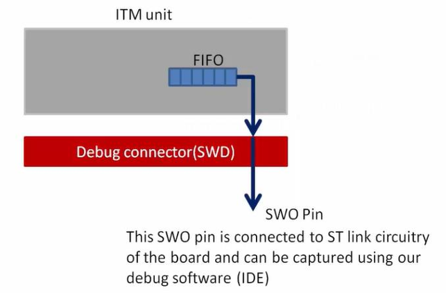

# Serial Wire Debug Protocol
- Serial Wire Debug (SWD) là một giao thức debug được sử dụng rộng rãi trong phát triển hệ thống nhúng, đặc biệt với các vi điều khiển ARM Cortex-M. SWD cung cấp một giao diện đơn giản, tốc độ cao để nạp chương trình và debug vi điều khiển, đồng thời **giảm số lượng chân so với JTAG truyền thống**.
- Giao thức SWD bao gồm các thành phần chính sau:
    - **SWDCLK (Serial Wire Debug Clock)**: Tín hiệu xung clock dùng để đồng bộ quá trình truyền dữ liệu giữa debugger và thiết bị đích.
    - **SWDIO (Serial Wire Debug Input/Output)**: Đường dữ liệu hai chiều, dùng để trao đổi lệnh và dữ liệu giữa debugger và vi điều khiển.
    - **SWO (Serial Wire Output)**: **Tín hiệu tùy chọn - optional**, chỉ có chiều từ vi điều khiển ra debugger, dùng cho trace và ghi log debug thời gian thực (ITM/SWV).
# ITM Unit (Instrumentation Trace Macrocell)
- ITM là một ngoại vi nằm bên trong core bộ vi xử lý (Cortex-M3 trở lên). Nó hỗ trợ **gỡ lỗi kiểu printf**, theo dõi sự kiện hệ thống mà **không làm gián đoạn luồng chạy chính của CPU (non-intrusive)**.
- Khi code ghi một ký tự vào thanh ghi ITM thông qua hàm printf, phần cứng sẽ tự động đẩy nó ra ngoài qua chân SWO của giao thức SWD.
