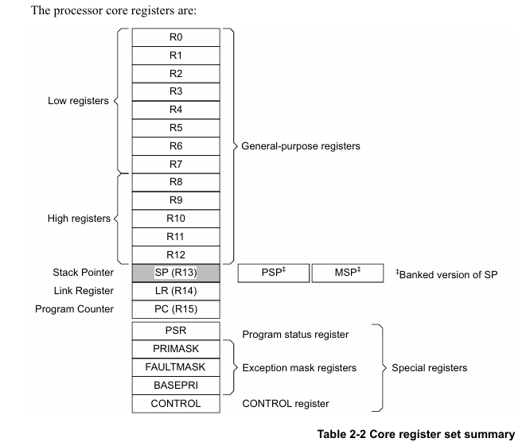
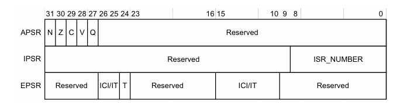
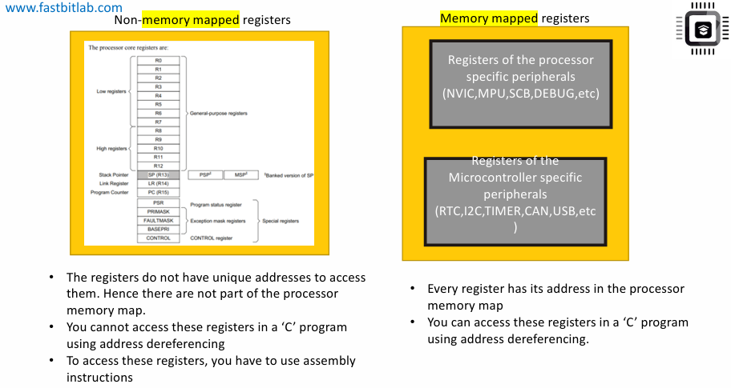

# Operational mode of the processer
## Bộ xử lý có 2 chế độ hoạt động chính:
- Thread Mode (Chế độ luồng - còn gọi là User Mode – chế độ người dùng): 
    - Mọi mã ứng dụng (application code) của bạn sẽ được thực thi trong Thread Mode.

    - Tức là khi chương trình đang chạy bình thường, không có ngắt, thì processor đang ở trong Thread Mode.

    - Đây là **trạng thái mặc định** khi chương trình khởi động.

- Handler Mode (Chế độ xử lý ngắt):
    - Tất cả Exception Handlers (trình xử lý ngoại lệ hệ thống)
và Interrupt Handlers (trình xử lý ngắt từ ngoại vi)
được thực thi trong Handler Mode.

    - Khi có một ngoại lệ hệ thống (System Exception) hoặc một ngắt (Interrupt) từ ngoại vi xảy ra,
bộ xử lý sẽ tự động chuyển sang Handler Mode,để chạy Interrupt Service Routine (ISR) tương ứng.

##  Bộ xử lý cung cấp hai mức truy cập (Access Levels)
- Mức truy cập thứ nhất là **privileged access level** (mức truy cập đặc quyền).Giả sử mã của bạn đang chạy với mức truy cập đặc quyền (privileged), thì mã đó có thể:
    - Truy cập tất cả các tài nguyên đặc biệt của bộ xử lý,

    - Truy cập và thay đổi các thanh ghi bị giới hạn (restricted registers).

- Mức thứ hai là **non-privileged access level** (mức truy cập không đặc quyền).Ngược lại, nếu mã của bạn đang chạy với **non-privileged access level** (gọi tắt là NPAL), thì bạn sẽ không thể truy cập hoặc thay đổi các thanh ghi bị giới hạn này.

-  Khi ở **Thread mode** chế độ mặc định luôn là **privileged access level**. Không thể quay lại privileged nếu đã chuyển sang chế độ khác.

- Chỉ có thể lấy lại quyền **privileged** khi có một ngắt xảy ra và CPU chuyển sang **Handler mode**.

- Nếu muốn chuyển từ **privileged** sang **non-privileged**, cần cấu hình một thanh ghi đặc biệt gọi là: **CONTROL Register** của CPU.

# Cortex M Processer Core Registers
- Các thanh ghi lõi (Core Resgisters) thực chất nằm bên trong lõi Cortex-M.
- Các thanh ghi này bao gồm:

- Ở đây các thanh ghi từ R0 đến R12 là thanh ghi đa dụng (general-purpose registers). Đây là các thanh ghi 32 bit và được dùng cho mục đích chung như :
    - Thao tác dữ liệu
    - Xử lý dữ liệu
    - Lưu trữ dữ liệu hoặc địa chỉ,..

- Thanh ghi R13 được gọi là stack pointer (SP) – con trỏ ngăn xếp. Nó dùng để theo dõi bộ nhớ ngăn xếp (stack memory). Trong R13, còn có 2 phiên bản khác:
    - PSP – Process Stack Pointer (con trỏ ngăn xếp tiến trình)
    - MSP – Main Stack Pointer (con trỏ ngăn xếp chính)

    Hai cái này được gọi là Banked version of stack pointer.Cả 3 đều là stack pointer, nhưng **chỉ một trong số đó hoạt động** tùy theo chế độ hoạt động của CPU.

- Thanh ghi R14 được gọi là LR (Link Register). Thanh ghi này **lưu thông tin trả về của lời gọi hàm (subroutine), function call** và **exception**. Khi reset vi xử lý đặt giá trị thanh ghi LR thành 0XFFFFFFFF.
- Thanh ghi R15 được gọi là program counter (PC). Nó chứa địa chỉ lệnh tiếp theo sẽ được thực thi. Khi reset bộ xử lý sẽ nạp PC **bằng giá trị của reset vector**.
- Trong các dòng vi điều khiển Arm Cortex M có tất cả **5 thanh ghi đặc biệt**.
- Thanh ghi **Program Status Register** lưu giữ trạng thái của lần thực thi hiện tại của chương trình.Là một thanh ghi 32 bit bản chất thanh ghi này là sự kết hợp của 3 thanh ghi khác nhau: 
    - APSR (Application Program Status Register) – chiếm 5 bit trong PSR.Chứa các cờ điều kiện dùng để phát hiện các kết quả phép toán trong ALU như kết quả âm, kết quả bằng 0,tràn số,......
    - IPSR (Interrupt Program Status Register) – chiếm các bit từ 0 đến 8. Chứa các số hiệu ngoại loeej của trình phục vụ ngắt hiện tại.
    - EPSR (Execution Program Status Register) – chiếm một số bit ở giữa (ví dụ bit 24, 25, 26 và vài bit khác). Trong đó có T-bit (Thumb bit) là cực kỳ quan trọng.
        - Nếu T-bit = 1 → CPU hiểu lệnh kế tiếp thuộc Thumb ISA (Instruction Set Architecture).
        - Nếu T-bit = 0 → CPU hiểu lệnh kế tiếp thuộc ARM ISA.

        Các vi xử lý ARM Cortex-Mx chỉ hỗ trợ Thumb state. Do đó, **T-bit phải luôn được giữ ở mức 1**.
    

# Non - memory mapped registers and Memory mapped registers
- Tất cả thanh ghi lõi của bộ xử lý như ở phần trên còn được gọi là **Non-memory mapped registers**. Bởi vì:
    - Các thanh ghi này không có địa chỉ duy nhất để truy cập.
    - Do đó, chúng không phải là một phần của bộ nhớ (memory map) của bộ xử lý.

    Không thể dùng toán tử địa chỉ và dereference trong C để truy cập chúng. Muốn truy cập các thanh ghi này, **phải dùng các lệnh Assembly.**

- Ngược lại **Memory mapped registers** là các thanh ghi nằm trong bản đồ bộ nhớ (memory map) của bộ xử lý. Nghĩa là **mỗi thanh ghi đều có một địa chỉ duy nhất**. Nhờ có địa chỉ đó, có thể dùng chương trình C để dereference và đọc/ghi dữ liệu vào thanh ghi.
- Memory mapped registers bao gồm 2 nhóm:
    - **Các thanh ghi thuộc về ngoại vi (peripherals) của bộ xử lý**.Ví dụ:NVIC, MPU, SCB,...
    - **Các thanh ghi thuộc về ngoại vi của vi điều khiển (microcontroller specific peripherals)**. Ví dụ: RTC (Real-Time Clock), I2C, Timer, CAN, USB,...Đây là các peripherals do nhà sản xuất vi điều khiển (vendor) bổ sung do vậy chúng cũng còn gọi là vendor-specific registers.

    