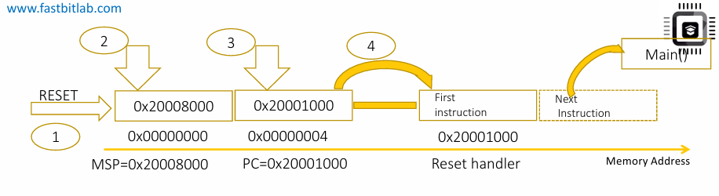
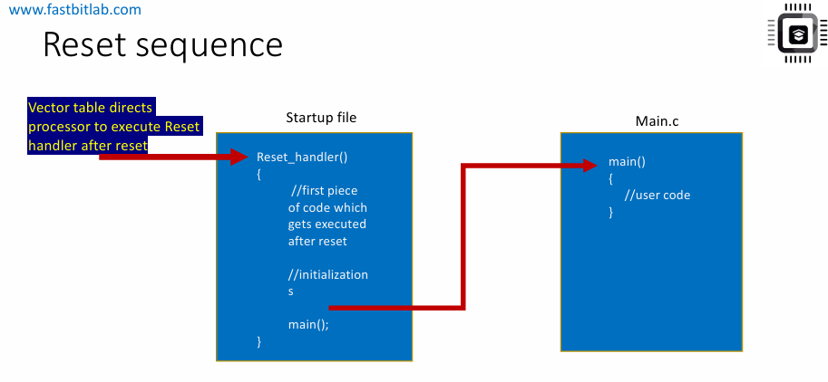
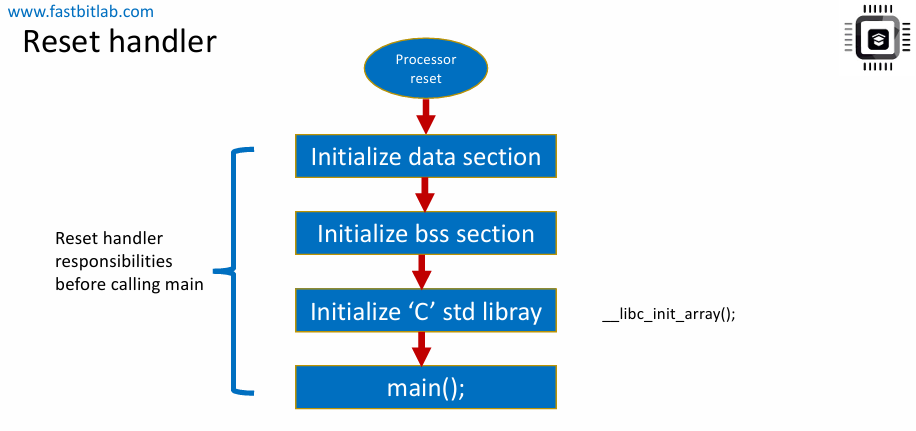

# Reset sequence of the processor
- Trình tự reset diễn ra như sau:
    - Bước 1: PC (Program Counter) sẽ được nạp với giá trị 0x0000_0000
    - Bước 2: CPU đọc giá trị tại địa chỉ bộ nhớ 0x0000_0000 và nạp vào MSP (Main Stack Pointer).
        - Địa chỉ bộ nhớ 0x0000_0000 thường nằm trong Flash/ROM (program memory).
        - Giá trị tại ô nhớ này chính là giá trị khởi tạo của MSP(Main stack pointer) 
    - Bước 3: CPU đọc giá trị tại địa chỉ bộ nhớ 0x0000_0004 và nạp vào PC.**Giá trị này chính là địa chỉ của reset handler**. Như vậy, PC sẽ nhảy tới reset handler.
    
    Reset handler thực chất là một hàm C hoặc Assembly do người dùng viết, để thực hiện các công việc khởi tạo (ví dụ: khởi tạo các vùng nhớ data, bss (copy từ Flash lên Ram), và khởi tạo thư việc C standard,...).
    - Bước 4: Sau khi reset handler hoàn tất,vi xử lý sẽ gọi tới hàm main() của chương trình ứng dụng.
    

# Nhiệm vụ của Reset Handler
- Nhiệm vụ của reset handler là **thực hiện một số khởi tạo ban đầu (early initialization)**, và sau đó nó **gọi chương trình người dùng**, tức là hàm main() của dự án.
- Reset handler thường được cài đặt trong startup file (tệp khởi động) của dự án.

- Reset handler thực hiện các bước khởi tạo sau:
    - Khởi tạo data section
    - Khởi tạo BSS section
    - Khởi tạo thư viện chuẩn C (C standard library) nếu nó được sử dụng.

    Đây là những bước **bắt buộc phải hoàn tất** trước khi gọi main().Nếu không thực hiện tất cả các bước khởi tạo này, thì không thể gọi trực tiếp main(), và chương trình người dùng có thể sẽ không hoạt động đúng.

    
