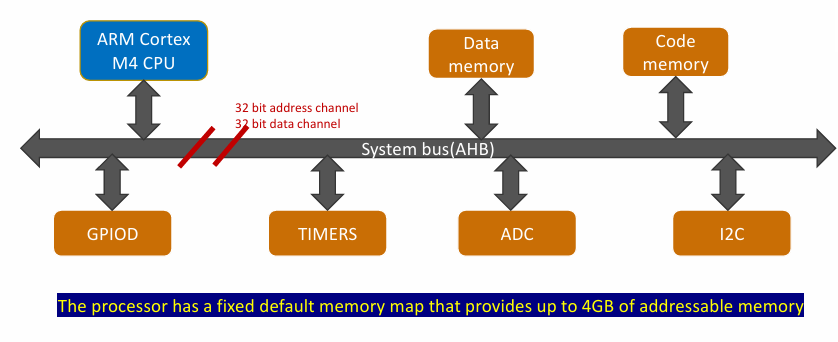
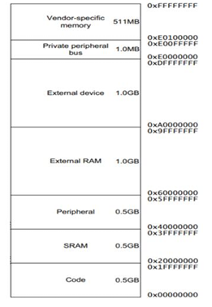
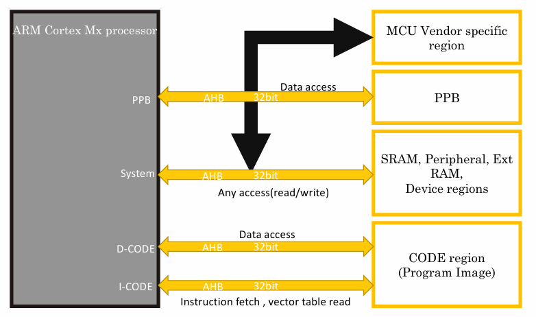
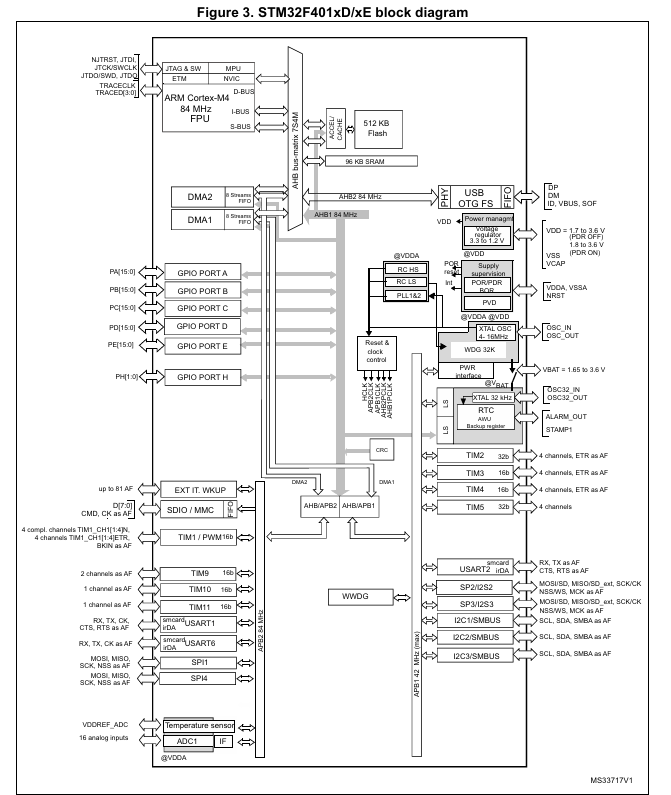
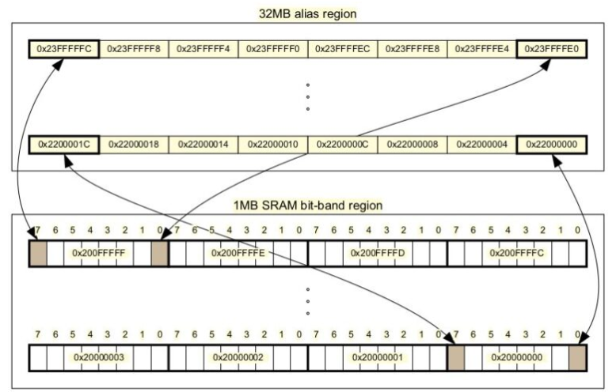
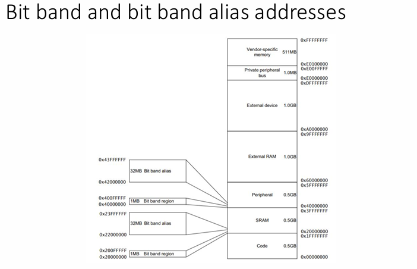

# Memory Mapped & Non - Memory Mapped Registers
- Như ở phần trước có thể thấy các Core Registers đều không có địa chỉ, chúng được gọi là những thanh ghi Non – Memory Mapped. Chúng đều nằm trong Core bộ xử lý và không có bất kỳ địa chỉ nào để truy cập chúng từ chương trình ‘C’. Muốn truy cập đến chúng, bắt buộc phải dùng tập lệnh ASM – Assembly. 
-  Ngược lại với Non - Memory Mapped Registers, các Memory Mapped Register - Thanh ghi ánh xạ bộ nhớ là một phần của Memory - Bản đồ bộ nhớ. Mỗi thanh ghi này đều có địa chỉ. Bằng cách sử dụng địa chỉ này, ta có thể đọc hoặc ghi dữ liệu vào thanh ghi này bằng chương trình ‘C’. Sử dụng địa chỉ dereferencing của chúng.
- Memory Mapped Registers chia làm 2 loại:
    - **Các thanh ghi liên quan đến ngoại vi bộ xử lý** (NVIC – Quản lý vector ngắt, MPU – Bảo vệ bộ nhớ, SCB – Điều khiển hệ thống, DEBUG – Bộ gỡ lỗi,…)
    - **Các thanh ghi liên quan ngoại vi của vi điều khiển** (GPIO, RTC, I2C, TIMER, CAN, USB,…)

# Memory Map
- Memory Map giải thích ánh xạ của các thanh ghi ngoại vi và bộ nhớ khác nhau trong phạm vi vùng nhớ có thể định địa chỉ của bộ xử lý.
- Trong bộ xử lý, vùng nhớ có thể định địa chỉ (Memory Mapped), phụ thuộc vào kích thước của bus địa chỉ.
- Ánh xạ của các vùng nhớ khác nhau trong vùng nhớ có thể định địa chỉ được gọi là Memory Map.

- Ví dụ như hình trên mạch liên kết chính là bus kết nối giúp kết nối bộ xử lý với bộ nhớ và các ngoại vi khác nhau của vi điều khiển.
- Bộ xử lý cũng giao tiếp với bộ nhớ, và bộ nhớ thường có hai loại chính:
    - Code memory – nơi chứa chương trình (các lệnh)
    - Data memory – nơi lưu dữ liệu tạm thời của chương trình
## Bộ xử lý giao tiếp như thế nào?
- Bộ xử lý giao tiếp với ngoại vi và bộ nhớ thông qua bus hệ thống (system bus).
- Bus hệ thống này có:
    - 32-bit address channel (bus địa chỉ 32 bit)
    - 32-bit data channel (bus dữ liệu 32 bit)
- Ví dụ: Một thanh ghi trong ADC chứa dữ liệu. Khi nhận lệnh từ code memory giả sử bộ xử lý muốn đọc dữ liệu:
    - Bước 1: Bộ xử lý phát địa chỉ của thanh ghi đó lên address bus
    - Bước 2: Khi địa chỉ trùng khớp, thanh ghi sẽ “mở khóa” và xuất giá trị của nó ra data bus
    - Bước 3: Dữ liệu đi vào một thanh ghi bên trong CPU
    - Bước 4: CPU sau đó ghi dữ liệu đó từ thanh ghi nội bộ sang bộ nhớ (data memory)
## Không gian địa chỉ
-  Bộ xử lý 32 bits của Vi điều khiển STM32 có thể tạo ra 4 GB giá trị vị trí bộ nhớ khác nhau, từ 0 đến 0xFFFF.
- Trong dải 4 GB này, các vùng được ánh xạ cố định bởi thiết kế của ARM (không thay đổi được). Đây chính là memory map.

- **Vùng nhớ Code** - 0.5GB: Có thể là bộ nhớ flash, EEPROM, ROM, OTP, … dùng để lưu code và các lệnh của chương trình.
- **Vùng nhớ SRAM** - 512MB: Chủ yếu sử dụng để kết nối SRAM trên chip, dùng để lưu trữ dữ liệu tạm thời khi run-time.
- **Vùng nhớ Peripheral** - 512MB: Sử dụng cho các thiết bị ngoại vi trên chip – của vi điều khiển.
- **Vùng nhớ External RAM** - 1GB: Kết nối các RAM ngoài chẳng hạn SDRAM.
Vùng nhớ Private Peripheral Bus - 512MB: Vùng Bus ngoại vi riêng tư: Các thanh ghi ngoại vi của bộ xử lý: như NVIC, Systick, ...

# Bus Protocol and Bus Interfaces
- Trong Cortex Mx, các giao diện bus dựa trên một đặc điểm kỹ thuật gọi là AMBA ( Advanced Microcontroller Bus Architecture ) - Kiến trúc Bus vi điều khiển nâng cao. AMBA là một kỹ thuật được thiết kế bở ARM, nhằm quản lý tiêu chuẩn cho truyền thông trên chip.
- AMBA hỗ trợ nhiều giao thức bus khác nhau, trong đó có 2 giao thức quan trọng là:
    - **AHB Lite**(AMBA High-performance Bus): thường được dùng cho các giao diện bus chính của vi điều khiển, đảm bảo tốc độ cao.
    - **APB** (AMBA Peripheral Bus): thường được dùng để **giao tiếp với các ngoại vi tốc độ thấp hơn**, hoặc các ngoại vi riêng (private peripherals), thông qua một cầu nối AHB–APB bridge.
-  Bộ xử lý đưa ra 4 giao diện bus AHB (như hình bên dưới): I-BUS, D-BUS, S-BUS, PPB, sử dụng các giao diện bus này để kết nối nhiều loại vùng nhớ khác nhau.   
    
    - I-CODE bus (Instruction bus): CPU dùng để lấy lệnh (instructions) và vector table từ code memory.
    - D-CODE bus (Data bus): CPU dùng để truy xuất dữ liệu nằm trong code region (ví dụ: hằng số, bảng dữ liệu...).Như vậy CPU có thể đồng thời lấy lệnh và lấy dữ liệu từ bộ nhớ chương trình (flash).
    - System bus (S-bus): CPU dùng để truy cập SRAM (data memory) và các ngoại vi on-chip (ADC, DAC, Timer, CAN, …).
    - Private Peripheral Bus (PPB): dùng để truy cập các thanh ghi ngoại vi riêng của nhân Cortex-Mx (NVIC, SysTick, System Control Block…).

- APB là một loại bus có hiệu năng thấp hơn so với AHB bus. Các ngoại vi **không cần tốc độ cao sẽ được kết nối vào các bus APB**. Ví dụ như hình bên dưới các ngoại vi như: SPI, UART, TIM, I2C,... được kết nối với APB2 và APB1.
- Thiết kế này cũng giúp nhà sản xuất vi điều khiển **giảm mức tiêu thụ điện năng**. Thay vì đưa tất cả các ngoại vi vào bus AHB (tốc độ cao, tiêu tốn điện năng), họ triển khai thêm nhiều bus hiệu năng thấp (APB), rồi kết nối các ngoại vi ít cần tốc độ cao vào đó.
- Trong bus interfaces của vi xử lý sẽ có **1 cầu nối hay chính là bộ chia** để chuyển đổi tín hiệu AHB thành tín hiệu APB.
    

# Bit-Banding
- Bit-banding là một tính năng cho phép **truy cập đến từng bit** riêng lẻ của một ô nhớ.
- Nghĩa là khi bạn ghi dữ liệu vào cùng **Bit Band Alias region** một thao tác đọc/sửa/ghi sẽ được tạo ra để thay đổi giá trị bit trong vùng **Bit Band Region**. 
- Tất cả các thao tác này được thực hiện bởi hệ thống vậy nên tốc độ xử lý rất nhanh.
- Ví dụ về bit banding với vùng SRAM như sau:

- Trong ARM Cortex-M có SRAM và vùng Peripheral có hỗ trợ bit-banding.
- Nhưng không phải toàn bộ, chỉ 1MB đầu tiên của SRAM và 1MB đầu tiên của Peripheral mới hỗ trợ.
