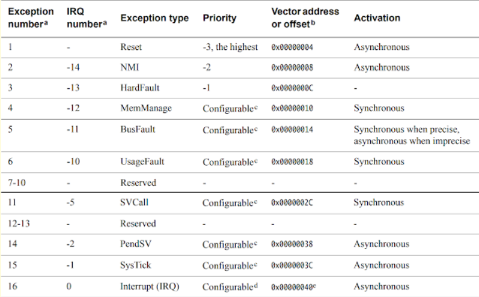
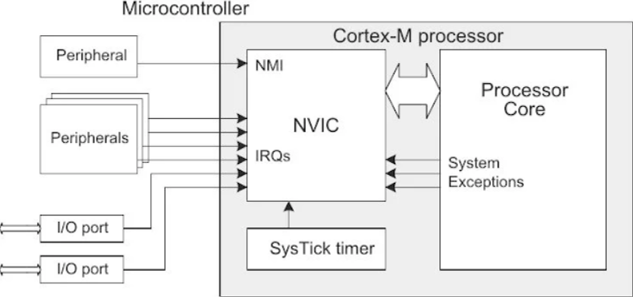
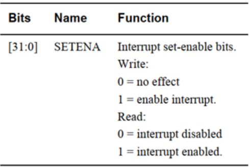
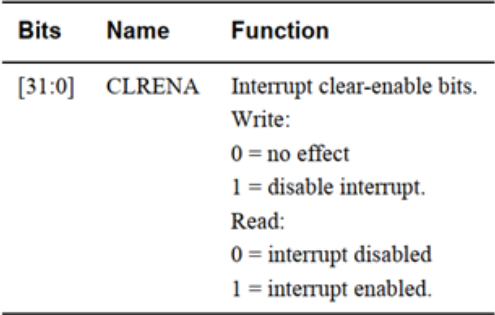
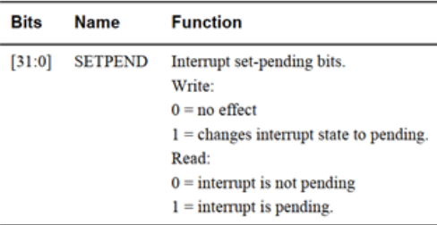
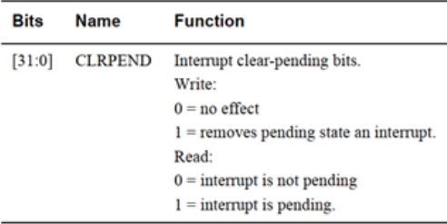
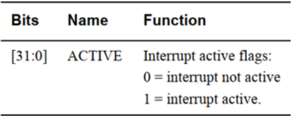
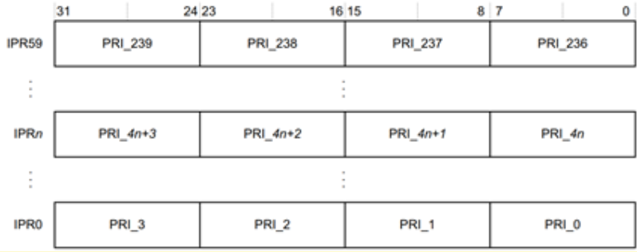

# Exception model
- Ngoại lệ (Exception) có thể hiểu là bất kỳ sự kiện nào làm **gián đoạn hoạt động bình thường** của chương trình bằng cách **thay đổi chế độ hoạt động** của bộ xử lý.
- Trong bộ xử lý ARM Cortex-M, có 2 loại ngoại lệ chính:
    - System exceptions (ngoại lệ hệ thống)
    - Interrupts (ngắt)
- System exceptions ( Ngoại lệ hệ thống ) được sinh ra bởi chính bộ xử lý. Nó là nội bộ của processor.
- Ngắt đến từ thế giới bên ngoài truyền vào processor.

=> Ngoại lệ (exception) là cách gọi chung cho system exceptions và interrupts.
- Bất cứ khi nào bộ xử lý gặp phải một ngoại lệ, nó sẽ **chuyển sang chế độ hoạt động "Handler mode" hay chương trình phục vụ ngắt**.
- Tổng cộng Cortex-M hỗ trợ 255 ngoại lệ (exceptions):
    - 240 ngắt
    - 15 ngoại lệ hệ thống

## Exceptions in Arm Cortex M
- Trong tài liệu Generic User Guide của ARM Cortex-M, ở mục exception model, có một bảng liệt kê rất rõ ràng tổng cộng có **15 ngoại lệ đầu tiên là system exceptions**, sau đó là các interrupts (IRQs).
- Danh sách các system exceptions gồm có: Reset, NMI (Non-Maskable Interrupt), HardFault, MemManage (Memory Management Fault), BusFault, UsageFault, SVCall, PendSV, SysTick
- Như vậy, chỉ có **9 ngoại lệ hệ thống được hỗ trợ**, còn các mục ở giữa sẽ hiển thị là reserved.

- **Reset Exception**
    - Reset là ngoại lệ được kích hoạt khi **Power-on Reset (cấp nguồn lần đầu)** hoặc **Warm Reset (reset lại bằng nút bấm)**.
    - Đây là tín hiệu Exception đặc biệt nhất, sẽ đưa hệ thống trở về trạng thái reset (giá trị thanh ghi, bộ nhớ), và đưa  Processor trở về Thread Mode (Các Exception khác xảy ra đưa Processor vào Handler Mode). 
    - Đây cũng là Exception **có mức ưu tiên cao nhất (-3)**.
- **NMI (Non-Maskable Interrupt)**
    - NMI (Non-Maskable Interrupt) = Ngắt không che được.
    - Là tín hiệu exception được thiết kế đến từ các peripheral hoặc Software, có **mức ưu tiên cao thứ hai (-2) chỉ sau Reset**. 
    - Khác với ngắt thông thường, **NMI không thể bị vô hiệu hóa luôn được CPU xử lý ngay lập tức**, không thể bỏ qua.
    - Thường được dùng cho tình huống khẩn cấp, yêu cầu CPU phải xử lý ngay lập tức.
- **HardFault**
    - Exception được tạo ra khi **có một số lỗi trong quá trình xử lý exception khác**, hoặc các lỗi mà **không có exception nào đảm nhiệm** đều gây ra Hardfault.
    - HardFault luôn luôn được kích hoạt (không cần enable).Nó có **độ ưu tiên cố định -1**, cao hơn mọi ngoại lệ có mức ưu tiên lập trình được.
- **MemManage Fault**
    - Exception xảy ra bởi một **truy cập trái phép vào bộ nhớ**.
- **BusFault**
    - Exception xảy ra khi có một lỗi xảy ra với các giao dịch trên instruction bus hoặc data bus.
    - Đây là lỗi ít gặp hơn trong thực tế.
- **UsageFault**
    - Exception xảy ra khi thực thi lệnh (Lệnh không hợp lệ (undefined instruction),truy cập dữ liệu không thẳng hàng (unaligned access), Lỗi trong quá trình quay lại từ handler,...), hoặc các lỗi như phép chia cho số 0 (division by zero).
- **SVCall (Supervisor Call)**
    - Ngoại lệ này được **tạo bởi lệnh SVC.**
    - Trong môi trường OS, lệnh SVC cho phép application truy cập vào OS kernel và device tree.
    - CPU sẽ chuyển sang Handler Mode, chạy SVC Handler ở mức privileged để xử lý yêu cầu. Đây là cách triển khai cơ chế system call trong OS.
- **PendSV**
    - Được dùng chủ yếu trong hệ điều hành thời gian thực (RTOS).
    - PendSV được dùng để **thực hiện context switching (chuyển đổi task)**.
- **SysTick**
    - Đây là **một timer nội bộ của Cortex-M**.
    - Khi bộ đếm về 0 sẽ sinh ra SysTick exception.
    - Trong hệ điều hành nhúng, SysTick được dùng để tạo tick hệ thống,  hỗ trợ context switching, delay, blocking call.

## NVIC(Nested Vectored Interrupt Controller), ISR Numbers and Enabling/Disabling Interrupts
-   Ngắt là một kỹ thuật thiết kế chương trình rất quan trọng trong lập trình Nhúng. Ngoài việc để chương trình chạy liên tục trong một vòng while(1) (kiểu polling), thì với những chương trình lớn, việc các sự kiện quan trọng không thể chờ đợi những sự kiện khác, thì việc sử dụng các ngắt là rất quan trọng. 
- Trong vi điều khiển STM32 hỗ trợ lên đến trên 200 ngắt khác nhau (240), chúng hoàn toàn có thể xảy ra cùng lúc, lồng nhau, ... Vì vậy, giống như một công ty hơn 200 nhân viên, chúng ta cần một nhà quản lý - đối với ngắt là NVIC - Nested Vector Interrupt Controller (Bộ điều khiển các vector ngắt lồng nhau).
- NVIC thực chất là **một ngoại vi (peripheral) của lõi ARM Cortex-M.**
- NVIC là một khối phần cứng nằm ngay trước CPU để **điều khiển toàn bộ “lưu lượng ngắt” (interrupt traffic)** đi vào bộ xử lý.

- NVIC có các tập thanh ghi riêng. Nhờ đó có thể bật/tắt các ngắt, đặt trạng thái pending cho ngắt, đọc trạng thái, cấu hình độ ưu tiên,...
- Tại sao lại gọi là "nested" bởi vì **NVIC hỗ trợ ngắt lồng nhau(nested interrupts)**. Nghĩa là: nếu một ngắt có ưu tiên cao hơn xảy ra, nó sẽ ngắt ngang (pre-empt) và tạm dừng trình xử lý ngắt có ưu tiên thấp hơn đang chạy.Sau khi ngắt ưu tiên cao xử lý xong, CPU sẽ quay lại tiếp tục ngắt trước đó.
- ARM Cortex-M chỉ cung cấp khung thiết kế (generic design) với tối đa 240 ngắt.Nhưng thực tế, tùy nhà sản xuất vi điều khiển (vendor) sẽ quyết định **có bao nhiêu ngắt**, và **mỗi line ngắt gắn với ngoại vi nào**.
- Ví dụ: Trên STM32 (STMicroelectronics): trong bảng vector table, có 83 ngắt ngoài (IRQ0 đến IRQ82).Watchdog được nối vào IRQ0 của NVIC.I²C được nối vào IRQ54 của NVIC.
### Các thanh ghi trong NVIC
- Như đã biết thì NVIC có thể bật/tắt cũng như đặt trạng thái pending cho các ngắt,... và để làm được điều đó cần tập thanh ghi của khối NVIC.
- **ISER - Interrupt Set-Enable Registers**
    - Có 8 thanh ghi để kích hoạt ngắt – dành cho 240 ngắt khác nhau. NVIC_ISER0 => NVIC_ISER7. 
    - Mỗi thanh ghi có kích thước là 32 bits => **Mỗi thanh ghi có thể kích hoạt 32 ngắt khác nhau.**  
    - 
- **ICER - Interrupt Clear-Enable Registers**
    - Có 8 thanh ghi để kích hoạt ngắt – dành cho 240 ngắt khác nhau. NVIC_ICER0 => NVIC_ICER7. 
    - Mỗi thanh ghi có kích thước là 32 bits => **Mỗi thanh ghi có thể tắt 32 ngắt khác nhau.**
    - 
- **ISPR - Interrupt Set-Pending Registers**  
    - Có 8 thanh ghi để kích hoạt ngắt – dành cho 240 ngắt khác nhau. NVIC_ISPR0 => NVIC_ISPR7, dùng để **buộc ngắt vào trạng thái chờ xử lý(pending)**. Bộ xử lý sẽ kiểm tra mức độ ưu tiên của các ngắt đang chờ xử lý để lần lượt thực thi chúng. 
    - 
- **ICPR - Interrupt Clear-Pending Registers**
    - Có 8 thanh ghi để kích hoạt ngắt – dành cho 240 ngắt khác nhau. NVIC_ICPR0 => NVIC_ICPR7, dùng để **loại bỏ trạng thái chờ xử lý.** Đọc nó để xem ngắt nào đang chờ xử lý.
    - 
- **IABR - Interrupt Active Bit Registers**
    -  Có 8 thanh ghi, NVIC_IABR0 => NVIC_IABR7, biểu thị cho việc **ngắt hoạt động hay không**. 
    - 
- **IPR - Interrupt Priority Registers**
    -  NVIC_IPR0 => NVIC_IPR59 cung cấp một **trường ưu tiên 8-bit cho mỗi ngắt** và **mỗi thanh ghi giữ 4 trường ưu tiên này**. Các thanh ghi này có thể truy cập từng byte.
    - 