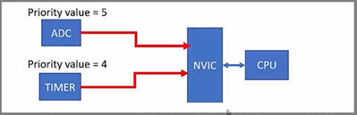
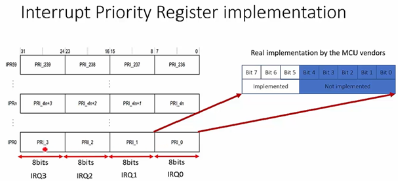
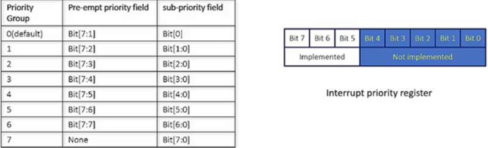

# What is interrupt priority ?
- **Mức độ ưu tiên** - Priority được coi là mức độ khẩn cấp của ngắt, tức là quy định ngắt nào cần được thực hiện trước.
- **Giá trị mức độ ưu tiên** – priority value là thước đo mức độ khẩn cấp của ngắt, còn gọi là mức độ ưu tiên – priority levels.  
-  Với Cortex Mx, giá trị ưu tiên này càng nhỏ thì mức độ ưu tiên càng lớn. Chẳng hạn, các exception của hệ thống đa số có mức ưu tiên nhỏ hơn 0 (trong đó Reset Handler có priority value nhỏ nhất, tương đương với mức độ ưu tiên lớn nhất). 
- Nếu hai ngắt xảy ra cùng lúc thì NVIC sẽ tiếp nhận thực thi ngắt có mức độ ưu tiên cao hơn (priority value thấp hơn), và đưa ngắt còn lại vào trạng thái chờ - Pending.

-  Ví dụ trên đây cho thấy 2 ngắt cùng xảy ra đó là ADC (Priority Value = 5) và Timer (Priority Value = 4). Vì vậy Timer Interrupt có mức độ ưu tiên cao hơn so với ADC Interrupt. Timer Interrupt sẽ được thực thi, trong khi đó ADC Interrupt sẽ được đưa vào hàng chờ Pending.
# Interrupt Priority Registers
- Bộ xử lý có bao nhiêu mức độ ưu tiên ngắt khác nhau phụ thuộc vào Thanh ghi Interrupt Priority, do nhà cung cấp MCU. Trong STM32 các thanh ghi này là từ NVIC_IPR0 => NVIC_IPR59
- **Mỗi thanh ghi NVIC_IPR** chia làm 4 phần, mỗi phần 8 bit để kiểm soát mức độ ưu tiên cho mỗi IRQ. Vậy mỗi thanh ghi sẽ đại diện cho 1 ngắt.
- Trong thực tế, không phải toàn bộ 8 bit đều được triển khai. Chỉ một số bit được sử dụng để kiểm soát mức độ ưu tiên: Ví dụ, có 8 priority levels cần 3 bit, trong khi 16 levels có 4 bits.
- STM32F4x có 16 mức độ ưu tiên khác nhau tức là sẽ có  4 bits của thanh ghi NVIC_IPR được sử dụng.

- Chẳng hạn, với 8 priority levels thì mỗi thanh ghi 8 bits sẽ cần 3 bits để triển khai.
# Pre-empt priority vs Sub priority
- Câu hỏi đặt ra là điều gì sẽ xảy ra nếu hai ngắt có cùng một mức độ ưu tiên xảy ra cùng một lúc? Xung đột có thể xảy ra, vì vậy, cần có một mức độ ưu tiên phụ (Sub Priority) để giải quyết vấn đề này.
- **Pre-Empt Priority:** Khi bộ xử lý đang chạy một trình xử lý ngắt và một ngắt khác xảy ra, thì các giá trị ưu tiên trước – pre-empt priority sẽ được so sánh và ngắt với mức độ pre-empt priority cao hơn (giá trị nhỏ hơn) sẽ được cho phép chạy.
- **Sub Priority:** Giá trị này chỉ được sử dụng khi hai ngắt có cùng giá trị pre-empty priority xảy ra cùng thời điểm. Trong trường hợp này, ngắt có mức ưu tiên phụ cao hơn sẽ được xử lý trước. 

- Có nhiều nhóm ưu tiên – priority grouping khác nhau và theo mặc định trong bộ xử lý Cortex Mx, nhóm ưu tiên = 0. 
- Nhóm ưu tiên phụ thuộc vào việc sử dụng **thanh ghi NVIC_IPRx.**
Ví dụ: Nhóm ưu tiên mặc định là 0, bit [7:1] được coi là pre-empt priority, còn bit 0 là sub priority.
# Pending Interrupt Behavior
