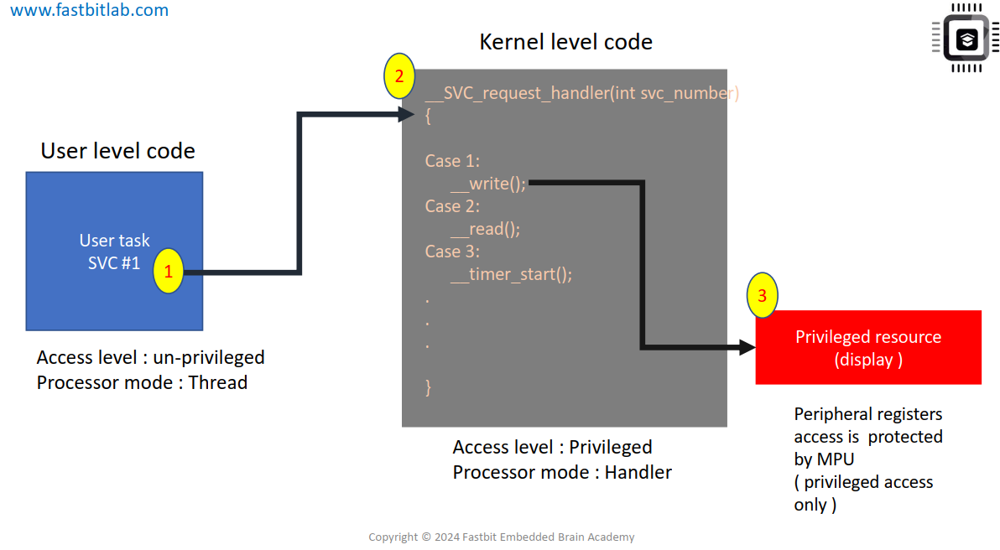

# What is SVC(Supervisory call)
- Các lời gọi giám sát (SVC) thường được dùng để **yêu cầu những thao tác đặc quyền** hoặc **truy cập tài nguyên hệ thống** từ một hệ điều hành. 
- Khi dùng một ứng dụng có hệ điều hành nhúng (embedded OS), hay hệ điều hành thời gian thực (RTOS), hoặc một bộ lập lịch đơn giản (scheduler), thì khi đó sẽ sử dụng ngoại lệ SVC và PendSV.
- Ví dụ: Một tác vụ không đặc quyền có thể dùng lệnh SVC để chuyển bộ xử lý sang chế độ đặc quyền, để có thể truy cập các tài nguyên đặc quyền như ngoại vi như là:
    - Truy cập trình điều khiển thiết bị (device driver)
    - Truy cập ngoại vi
    - Truy cập một số vùng bộ nhớ bị hạn chế.
=> Ứng dụng phải dùng SVC vì **nó không có quyền trực tiếp truy cập tài nguyên hệ thống**, chỉ kernel mới có. SVC chính là **“cầu nối an toàn”** giữa user task (không đặc quyền) và kernel (có đặc quyền).
- Lệnh SVC luôn đi kèm với một số gọi là SVC number hoặc SVC argument. Số này được kernel dùng để nhận diện loại yêu cầu. Do đó, sau khi lệnh SVC được thực hiện, trình xử lý SVC (SVC handler) sẽ chạy ngay lập tức (trừ khi cùng lúc có một ngoại lệ ưu tiên cao hơn xuất hiện).

## Kịch bản minh họa
- Giả sử ta có một ứng dụng với 2 phần:
    - Mã người dùng (user task) – chạy ở mức unprivileged (không đặc quyền) trong chế độ thread mode.
    - Mã kernel (kernel code) – chạy ở mức privileged (đặc quyền).
- Nếu để tác vụ người dùng có toàn quyền, chúng có thể thay đổi các thanh ghi hệ thống, gây mất an toàn. Vì vậy kernel luôn giới hạn quyền của chúng.

- Ví dụ: Có một tài nguyên đặc quyền, ở đây là màn hình hiển thị (display). Màn hình này được điều khiển thông qua các thanh ghi cấu hình và thanh ghi dữ liệu.
- Tác vụ người dùng không được phép trực tiếp truy cập vào những thanh ghi này, vì có thể làm hỏng hoặc gây lỗi hiển thị.
- Thay vào đó: Tác vụ người dùng sẽ gọi lệnh SVC 1 để gửi yêu cầu đến kernel. Trình xử lý SVC trong kernel nhận yêu cầu này, đọc số 1 và ánh xạ nó tới dịch vụ “ghi dữ liệu ra màn hình”.
- Sau đó kernel mới thực hiện việc ghi dữ liệu vào màn hình. Như vậy, kernel sẽ đóng vai trò bảo vệ tài nguyên đặc quyền, ngăn không cho mã người dùng tự ý thao tác.
- Nếu bộ xử lý có Memory Protection Unit (MPU), kernel có thể cấu hình để chặn quyền truy cập của tác vụ người dùng vào vùng địa chỉ của thanh ghi màn hình. Nếu người dùng vẫn cố gắng truy cập, ngoại lệ Memory Manage Fault sẽ được kích hoạt, và kernel có thể hủy tác vụ đó.
- Điều này giúp nâng cao tính an toàn và độ tin cậy của hệ thống.