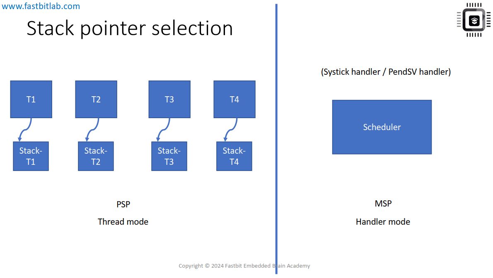
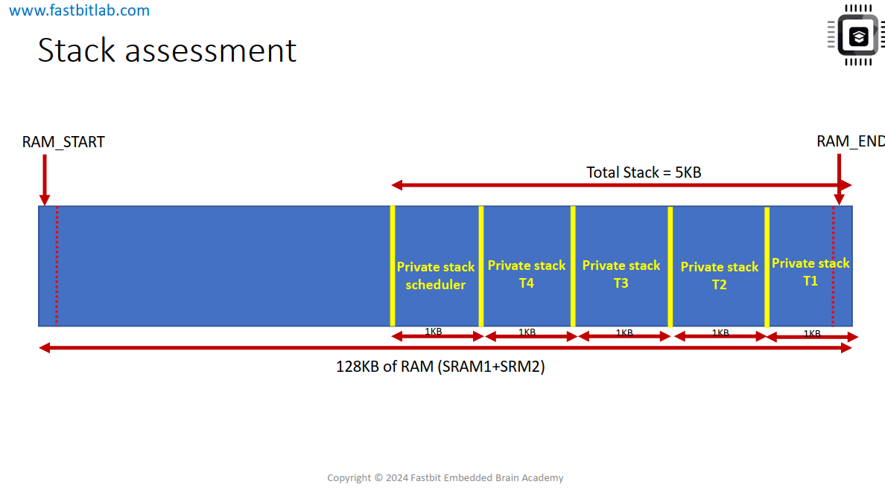
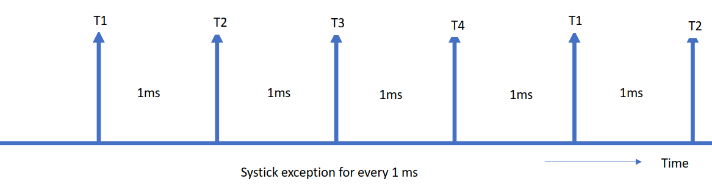
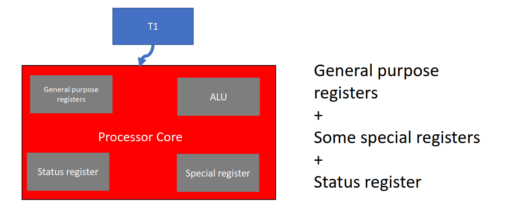
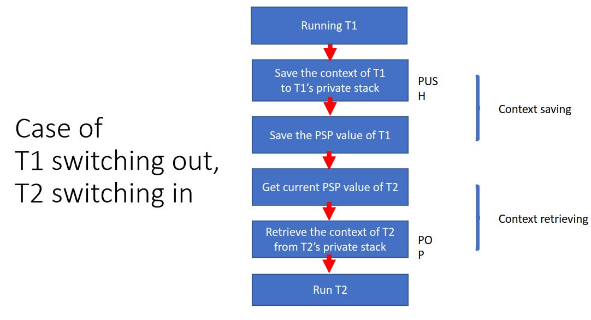

# What is a task ?
- Một task thực chất **là một đoạn code, hoặc có thể gọi nó là một hàm (ngôn ngữ 'C')**, thực hiện một công việc cụ thể khi nó được phép chạy trên CPU.

- Một task có vùng ngăn xếp (Stack) riêng để tạo các biến cục bộ khi nó thực thi trên CPU. Ngoài ra, khi bộ lập lịch quyết định đưa một task ra khỏi CPU, trước tiên nó sẽ lưu lại ngữ cảnh (Context/State) của tác vụ đó vào vùng ngăn xếp riêng (private stack) của tác vụ.

=> Tóm lại, một đoạn code hoặc một hàm được gọi là một task khi nó có khả năng được lập lịch (schedulable) và không bao giờ bị mất đi "trạng thái" của mình trừ khi nó bị xóa vĩnh viễn.
# PSP and MSP in task scheduler

- MSP (Main Stack Pointer): Luôn được sử dụng sau khi reset và trong các trình phục vụ ngắt (Handler Mode). Scheduler của chúng ta nằm trong ngắt SysTick nên dùng MSP.

- PSP (Process Stack Pointer): Được dùng bởi các tiến trình người dùng (Thread Mode). Việc tách biệt này giúp ngăn lỗi tràn stack của một ứng dụng làm hỏng vùng nhớ của hệ điều hành.
# Stack Assessment
- Trong lập trình C thông thường, hiếm khi phải lo lắng về Stack vì trình biên dịch và Startup code đã làm hết. Nhưng khi viết Scheduler, ta sẽ phải đóng vai trò là "người quản lý tài nguyên".

- Trong ví dụ này mỗi task có một stack riêng nằm cố định trong RAM và stack này sẽ không thay đổi trong quá trình chạy trừ khi task bị xóa. Khi xảy ra ngắt SysTick, CPU lưu context của task hiện tại vào stack của task thông qua PSP, sau đó chuyển sang Handler mode và sử dụng MSP để chạy scheduler trên stack riêng của kernel(private stack scheduler). Scheduler chọn task tiếp theo, nạp lại PSP để trỏ vào stack của task đó, rồi CPU quay về Thread mode để tiếp tục thực thi task.
- Tham khảo thêm: [Context Switching trên FreeRTOS với STM32](https://github.com/tuyenXuly/FreeRTOS_with_STM32_tutorials/blob/master/Part%2011%20Context%20Switching/README.md)

# Scheduling policy
- Scheduling Policy (chính sách lập lịch) là thuật toán được Scheduler sử dụng để quyết định nhiệm vụ (task) nào sẽ được thực thi tại mỗi thời điểm.
- Trong ví dụ này sẽ xây dựng 1 bộ lập lịch đơn giản sử dụng chính sách **round-robin pre-emptive scheduling** có nghĩa là: ngắt quãng một tác vụ đang chạy để đưa một tác vụ mới hoặc tác vụ tiếp theo đang ở trạng thái sẵn sàng (ready state) vào thực thi. Trong ứng dụng này, không xem xét đến độ ưu tiên của tác vụ (không có giá trị ưu tiên khác nhau). Bộ lập lịch sẽ thực thi sau mỗi 1 mili giây (ms) đơn giản là cứ xoay vòng các task để chạy.

- Khi một task chạy, nó sử dụng các **thanh ghi đa năng - General Purpose Registers**, **thanh ghi trạng thái - Status Register** và **thanh ghi đặc biệt - special registers** . Do đó, tập hợp các giá trị trong các thanh ghi này tại một thời điểm chính là **trạng thái của task - Execution Context hay State of Task**. Khi bộ lập lịch muốn hoán đổi task, nó **phải lưu lại các kết quả trung gian đang nằm trong các thanh ghi này vào ngăn xếp riêng (private stack) của tác vụ đó**.

- Xét 2 task T1 và T2 và hiểu cách T1 bị switch out và T2 được switch in CPU.

## Stacking và Unstacking hoạt động khi exception xảy ra
- Task đang chạy trong Thread Mode, sử dụng PSP. Khi exception xảy ra.  Thread mode bị pre-empted, handler mode chạy (exception handler).
CPU tự động lưu một stack frame. Stack frame này lưu context/state của task hiện tại (T1). Đây gọi là stacking, CPU làm tự động. Khi handler kết thúc:
CPU khôi phục stack frame và trở lại Thread Mode để tiếp tục chạy task cũ.Đây gọi là unstacking. 
- Nhưng với bộ lập lịch chúng ta không muốn quay lại T1, mà muốn chạy T2. Trong exception handler, chúng ta thay đổi PSP: PSP từ stack của T1 thành stack của T2. Đặt return address thành địa chỉ handler của T2. Khi thoát handler, CPU sẽ chạy T2 thay vì T1. Đây là "mẹo" trong context switching preemptive trên ARM Cortex-M.

