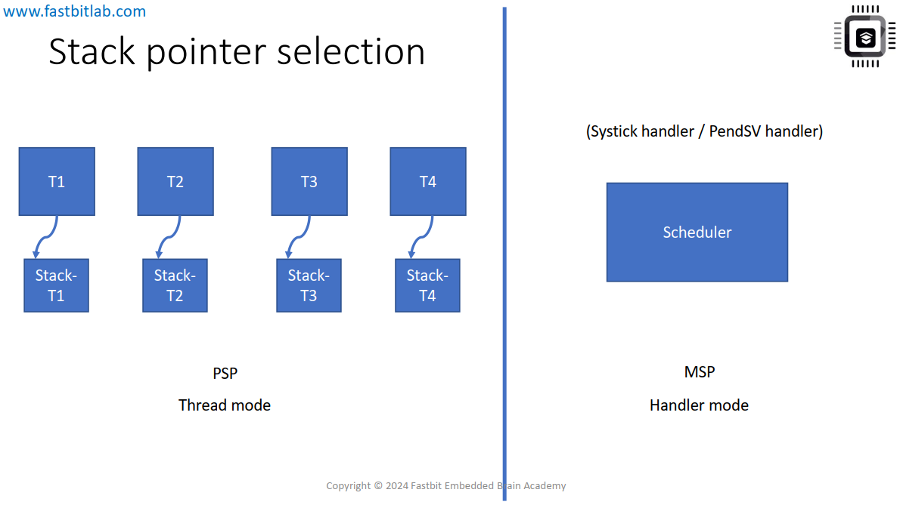
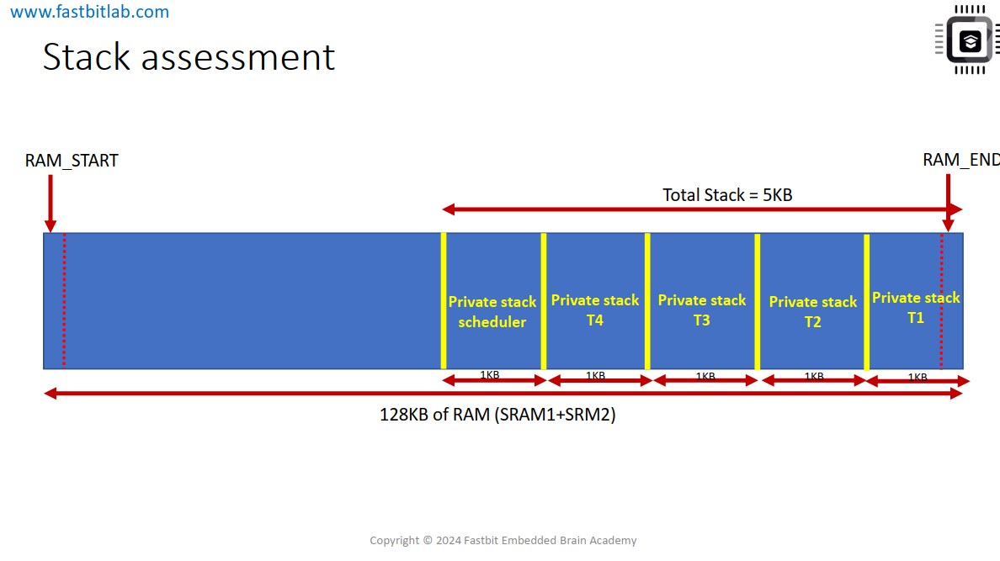
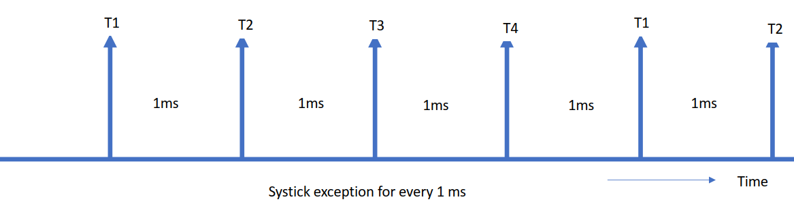
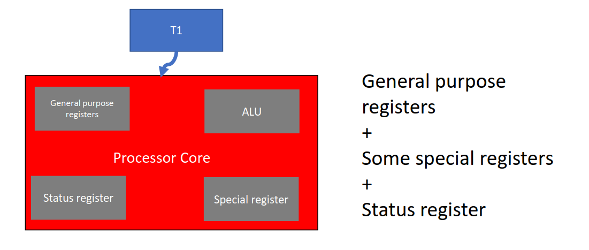
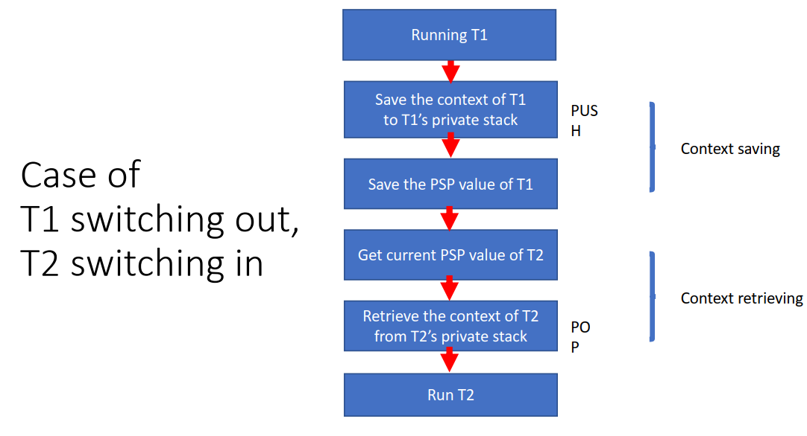
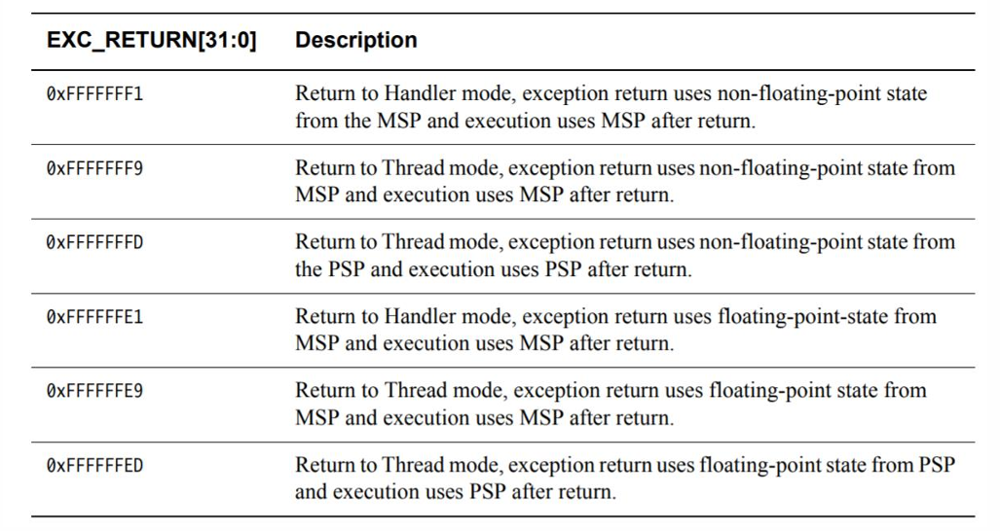

# What is a task ?
- Một task thực chất **là một đoạn code, hoặc có thể gọi nó là một hàm (ngôn ngữ 'C')**, thực hiện một công việc cụ thể khi nó được phép chạy trên CPU.

- Một task có vùng ngăn xếp (Stack) riêng để tạo các biến cục bộ khi nó thực thi trên CPU. Ngoài ra, khi bộ lập lịch quyết định đưa một task ra khỏi CPU, trước tiên nó sẽ lưu lại ngữ cảnh (Context/State) của tác vụ đó vào vùng ngăn xếp riêng (private stack) của tác vụ.

=> Tóm lại, một đoạn code hoặc một hàm được gọi là một task khi nó có khả năng được lập lịch (schedulable) và không bao giờ bị mất đi "trạng thái" của mình trừ khi nó bị xóa vĩnh viễn.
# PSP and MSP in task scheduler

- MSP(Main Satck Pointer) là stack mặc định của hệ thống. Sau khi reset, CPU luôn chạy ở Thread Mode với MSP. Ngoài ra, **mọi exception và interrupt (Handler Mode) đều bắt buộc sử dụng MSP**, không phụ thuộc Thread Mode đang dùng stack nào.
- Trong hệ thống có scheduler, Scheduler chạy trong ngắt SysTick (Handler Mode)Vì vậy scheduler luôn sử dụng MSP. MSP thường được xem là stack của hệ điều hành / kernel, đảm bảo xử lý ngắt và exception một cách an toàn.

- PSP(Process Stack Pointer) chỉ được sử dụng trong Thread Mode khi **hệ điều hành hoặc ứng dụng chủ động chọn PSP**. PSP thường được cấp riêng cho từng tiến trình (task/user thread).
- Việc tách PSP khỏi MSP giúp:
    - Ngăn tràn stack của tiến trình làm hỏng stack của hệ điều hành
    - Tăng độ an toàn và ổn định hệ thống
    - Đơn giản hóa việc chuyển ngữ cảnh (context switch)
    - PSP không bao giờ được dùng trong Handler Mode.
# Stack Assessment
- Trong lập trình C thông thường, hiếm khi phải lo lắng về Stack vì trình biên dịch và Startup code đã làm hết. Nhưng khi viết Scheduler, ta sẽ phải đóng vai trò là "người quản lý tài nguyên".

- Trong ví dụ này mỗi task có một stack riêng nằm cố định trong RAM và stack này sẽ không thay đổi trong quá trình chạy trừ khi task bị xóa. Khi xảy ra ngắt SysTick, CPU lưu context của task hiện tại vào stack của task thông qua PSP, sau đó chuyển sang Handler mode và sử dụng MSP để chạy scheduler trên stack riêng của kernel(private stack scheduler). Scheduler chọn task tiếp theo, nạp lại PSP để trỏ vào stack của task đó, rồi CPU quay về Thread mode để tiếp tục thực thi task.
- Tham khảo thêm: [Context Switching trên FreeRTOS với STM32](https://github.com/tuyenXuly/FreeRTOS_with_STM32_tutorials/blob/master/Part%2011%20Context%20Switching/README.md)

# Scheduling policy
- Scheduling Policy (chính sách lập lịch) là thuật toán được Scheduler sử dụng để quyết định nhiệm vụ (task) nào sẽ được thực thi tại mỗi thời điểm.
- Trong ví dụ này sẽ xây dựng 1 bộ lập lịch đơn giản sử dụng chính sách **round-robin pre-emptive scheduling** có nghĩa là: ngắt quãng một tác vụ đang chạy để đưa một tác vụ mới hoặc tác vụ tiếp theo đang ở trạng thái sẵn sàng (ready state) vào thực thi. Trong ứng dụng này, không xem xét đến độ ưu tiên của tác vụ (không có giá trị ưu tiên khác nhau). Bộ lập lịch sẽ thực thi sau mỗi 1 mili giây (ms) đơn giản là cứ xoay vòng các task để chạy.

- Khi một task chạy, nó sử dụng các **thanh ghi đa năng - General Purpose Registers**, **thanh ghi trạng thái - Status Register** và **thanh ghi đặc biệt - special registers** . Do đó, tập hợp các giá trị trong các thanh ghi này tại một thời điểm chính là **trạng thái của task - Execution Context hay State of Task**. Khi bộ lập lịch muốn hoán đổi task, nó **phải lưu lại các kết quả trung gian đang nằm trong các thanh ghi này vào ngăn xếp riêng (private stack) của tác vụ đó**.

- Xét 2 task T1 và T2 và hiểu cách T1 bị switch out và T2 được switch in CPU.

## Stacking và Unstacking hoạt động khi exception xảy ra
- Task đang chạy trong Thread Mode, sử dụng PSP. Khi exception xảy ra,  Thread mode bị pre-empted, handler mode chạy (exception handler).
CPU tự động lưu một stack frame. Stack frame này lưu context/state của task hiện tại (T1). Khi handler kết thúc CPU khôi phục stack frame và trở lại Thread Mode để tiếp tục chạy task cũ. Đây gọi là unstacking. 
- Nhưng với bộ lập lịch chúng ta không muốn quay lại T1, mà muốn chạy T2. Trong exception handler, chúng ta thay đổi PSP: PSP từ stack của T1 thành stack của T2. Đặt return address thành địa chỉ handler của T2. Khi thoát handler, CPU sẽ chạy T2 thay vì T1. Đây là "mẹo" trong context switching preemptive trên ARM Cortex-M.
## Chỉ thị __attribute__((naked))
- Trong lập trình nhúng với trình biên dịch GCC (phổ biến cho ARM Cortex-M4), __attribute__((naked)) là một chỉ thị cực kỳ đặc biệt. Để hiểu chi tiết, chúng ta sẽ đi từ cách một hàm thông thường hoạt động đến sự "khác biệt" của hàm Naked.
- Hàm thông thường (Normal Function)
Khi bạn viết một hàm C bình thường, trình biên dịch sẽ tự động sinh ra hai đoạn mã bao quanh nội dung hàm để quản lý bộ nhớ:
    - Prologue (Đoạn mở đầu): Thực hiện các lệnh Assembly như PUSH để lưu địa chỉ phản hồi (LR) và các thanh ghi quan trọng vào Stack. Nó cũng chuẩn bị vùng nhớ cho các biến cục bộ.
    - Epilogue (Đoạn kết thúc): Thực hiện các lệnh như POP để khôi phục lại các thanh ghi và lệnh BX LR để quay về hàm gọi nó.
-  Khi bạn thêm __attribute__((naked)), bạn đang nói với trình biên dịch rằng: "Đừng thêm bất kỳ mã Prologue hay Epilogue nào cả. Hãy để tôi tự viết mọi thứ bằng Assembly." Hàm này sẽ "trống rỗng" hoàn toàn về mặt quản lý Stack. Nó chỉ chứa duy nhất những dòng mã mà bạn viết bên trong.
- Lưu ý: 
    - Phải tự viết lệnh quay về: Bạn bắt buộc phải có lệnh BX LR (hoặc tương đương) ở cuối hàm. Nếu không, CPU sẽ thực thi lèo sang vùng nhớ tiếp theo và treo máy.
## Thanh ghi LR (Link Register)
- Thanh ghi LR (Link Register), ký hiệu là thanh ghi R14, là một thanh ghi đặc biệt trong kiến trúc ARM Cortex-M4. Vai trò chính của nó là "ghi nhớ" địa chỉ để CPU biết đường quay về sau khi thực hiện xong một chương trình con (hàm) hoặc một ngắt.
- Khi bạn gọi một hàm bằng lệnh BL (Branch with Link), CPU sẽ thực hiện hai việc đồng thời:
    - Lưu địa chỉ của lệnh ngay sau lệnh BL vào thanh ghi LR.
    - Nhảy đến địa chỉ của hàm đó để thực thi.
- Khi hàm kết thúc, lệnh **BX LR** sẽ lấy địa chỉ từ LR nạp vào PC để quay về chương trình chính. Lưu trữ: Địa chỉ phản hồi (Return Address).
- **Khi xảy ra Ngắt (Exception/Interrupt)**: Đây là điểm đặc biệt và mấu chốt nhất. Khi một ngắt xảy ra, thanh ghi LR không lưu địa chỉ quay về (vì địa chỉ đó đã được phần cứng tự động đẩy vào Stack - vị trí của thanh ghi PC). Thay vào đó, LR sẽ lưu một giá trị "Ma thuật" (Magic Value) gọi là EXC_RETURN. Các giá trị được thể hiện ở trong ảnh.

## Blocking state for tasks
- Khi một task không có việc gì để làm, nó chỉ cần gọi một hàm delay.Hàm này sẽ chuyển task từ trạng thái Running (đang chạy) sang trạng thái Blocked (bị chặn) và giữ task ở trạng thái Blocked cho đến khi khoảng thời gian delay đã chỉ định kết thúc.
- Bây giờ, hệ thống sẽ duy trì 2 trạng thái cho mỗi task:
    - Running – task sẵn sàng để được scheduler chạy
    - Blocked – task tạm thời không được chạy do đang chờ hết thời gian delay
- Scheduler chỉ được phép lập lịch (schedule) cho các task đang ở trạng thái Running. Các task ở trạng thái Blocked sẽ không được chọn để chạy.
- Scheduler cũng có trách nhiệm kiểm tra và mở chặn (unblock) các task đang bị Blocked.
Khi thời gian chặn (blocking period) của một task kết thúc, scheduler sẽ:
    - Chuyển task đó từ trạng thái Blocked trở lại trạng thái Running
    - Cho phép task được lập lịch và chạy trở lại.
## Task Blocking
- Ở đây sẽ tạo một hàm gọi là “task_delay”. Hàm này sẽ đưa tác vụ đang gọi nó vào trạng thái bị chặn (blocked state) trong một số lượng ticks nhất định.
- Ví dụ: task_delay(1000);. Nếu một tác vụ gọi hàm này, hàm task_delay sẽ đưa tác vụ đó vào trạng thái bị chặn và cho phép tác vụ tiếp theo được chạy trên CPU. Ở đây, con số 1000 biểu thị khoảng thời gian bị chặn tính theo đơn vị ticks. Tác vụ gọi hàm này sẽ bị chặn trong 1000 ticks (tương đương với 1000 lần xảy ra ngoại lệ SysTick), tức là trong 1000ms (vì mỗi nhịp xảy ra định kỳ mỗi 1ms).
- Bộ lập lịch (scheduler) nên kiểm tra khoảng thời gian bị chặn đã trôi qua của mỗi tác vụ đang bị chặn, và đưa chúng trở lại trạng thái đang chạy (running state) nếu thời gian chặn đã kết thúc.
## Idle task
- Một vấn đề sẽ xảy ra nếu tất cả các tác vụ đều bị chặn. Task nào sẽ chạy trên CPU. Từ vấn đề này ta sẽ sử dụng một tác vụ rảnh rỗi (idle task) để chạy trên CPU nếu tất cả các tác vụ người dùng đều đang bị chặn.
- Tác vụ rảnh cũng tương tự như các tác vụ người dùng, nhưng nó chỉ chạy khi tất cả các tác vụ người dùng khác đều đã bị chặn.
- Ta có thể đưa CPU vào chế độ ngủ (sleep) bên trong tác vụ rảnh này để tiết kiệm năng lượng.
## Tranh chấp giữa Exception Handler và Thread Mode
- Trong một chương trình C thông thường, mã chạy tuần tự từ trên xuống dưới. Tuy nhiên, trong hệ thống nhúng:
    - Thread Mode: Là mã chạy bình thường của bạn (ví dụ các hàm task_handler hoặc main).
    - Handler Mode: Là các trình xử lý ngoại lệ (như SysTick_Handler, PendSV_Handler).
=> Các ngắt có quyền ngắt ngang (preempt) mã ở chế độ Thread bất cứ lúc nào, tại bất kỳ dòng lệnh nào nên có khả năng xảy ra tình trạng **Race Condition (Tranh chấp dữ liệu)**.
- **Một biến toàn cục có thể truy cập bởi cả các tác vụ người dùng và từ các trình xử lý ngoại lệ**. Đây là một vùng nhớ dùng chung, do đó có thể xảy ra tranh chấp giữa mã ở chế độ Thread và mã ở chế độ Handler.
- Ví dụ: 
    - Giả sử bạn có một biến toàn cục g_counter dùng để đếm số lượng sự kiện:
        - Thread Mode (Task 1) đang thực hiện lệnh: g_counter++;
        - Thực tế, ở mức hợp ngữ (Assembly), lệnh này không phải là một bước duy nhất mà gồm 3 bước:
            - Bước A: Đọc giá trị từ RAM vào thanh ghi (ví dụ: R0 = 10).
            - Bước B: Tăng giá trị trong thanh ghi (R0 = 11).
            - Bước C: Ghi giá trị từ thanh ghi ngược lại RAM (g_counter = 11).

        - Sự cố xảy ra: Khi Task 1 vừa xong Bước A (R0 = 10), bỗng nhiên một ngắt SysTick xảy ra.
        - Handler Mode chạy và nó cũng thực hiện g_counter++;. Nó đọc RAM (đang là 10), tăng lên 11 và ghi lại vào RAM. Lúc này g_counter trong RAM là 11.
        - Ngắt kết thúc, CPU quay lại Task 1 và tiếp tục Bước B & C với giá trị R0 cũ đang giữ (10). Nó tăng lên 11 và ghi đè vào RAM.
        - Kết quả: Đáng lẽ g_counter phải là 12 (vì có 2 lần tăng), nhưng thực tế nó chỉ là 11. Một sự kiện đã bị "mất tích".